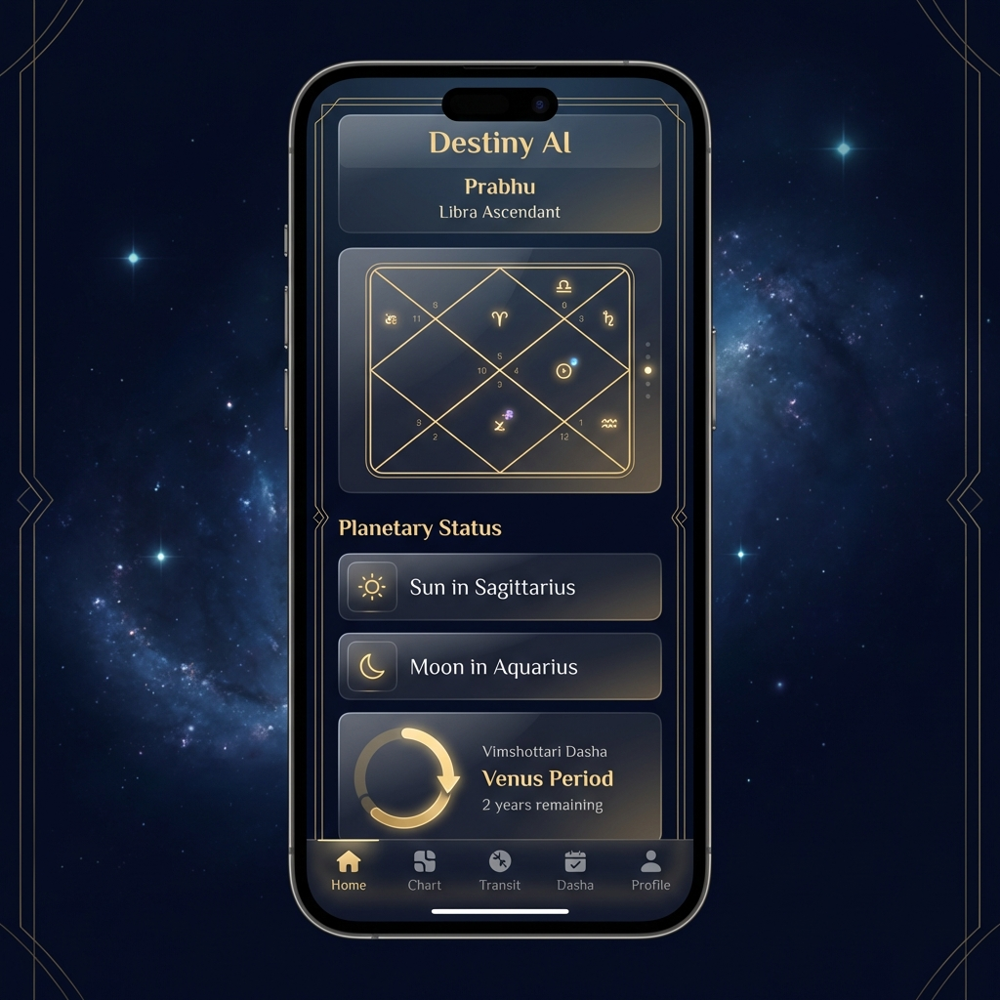
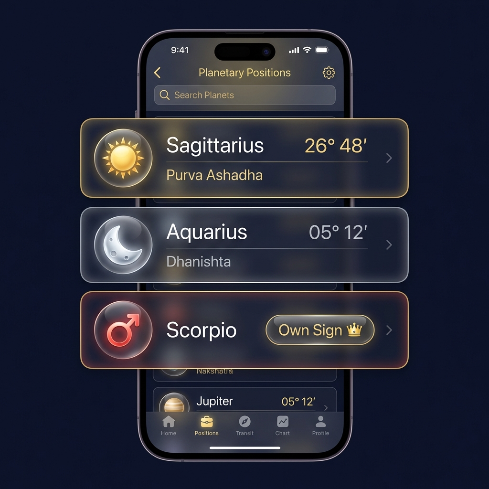
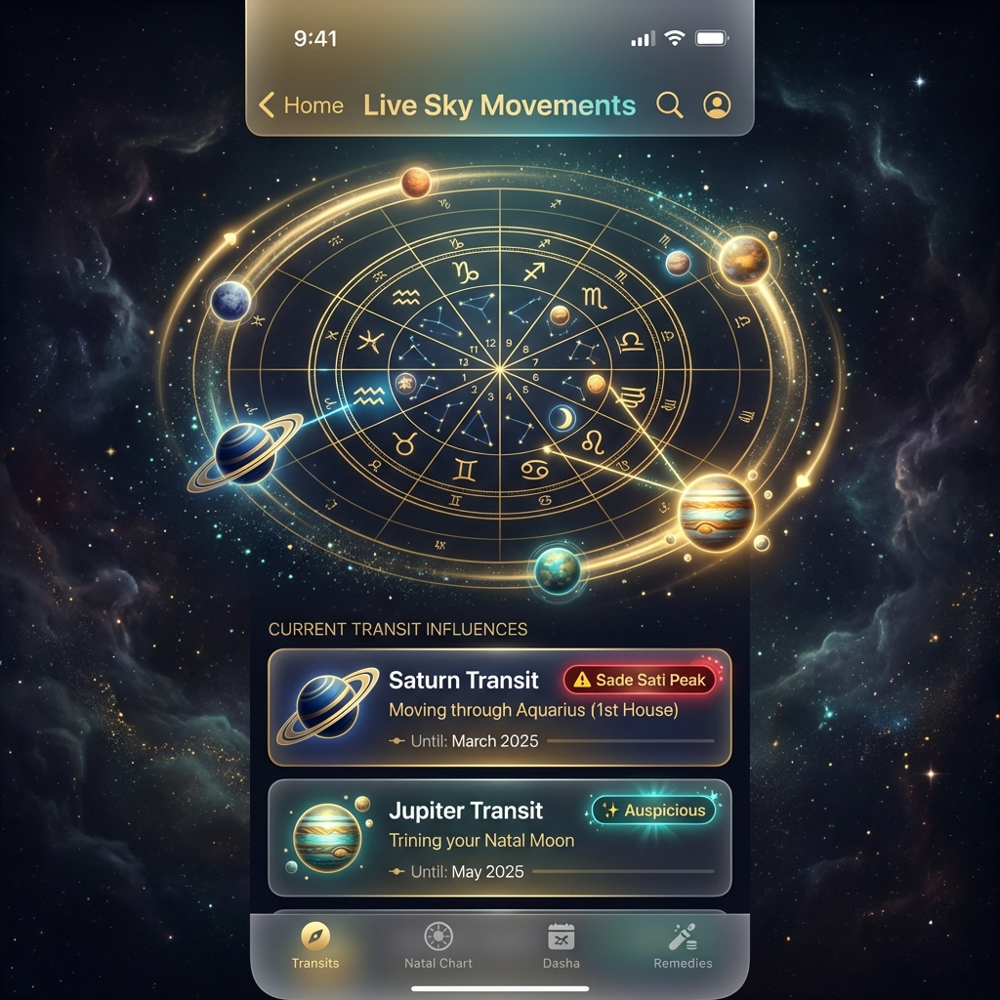
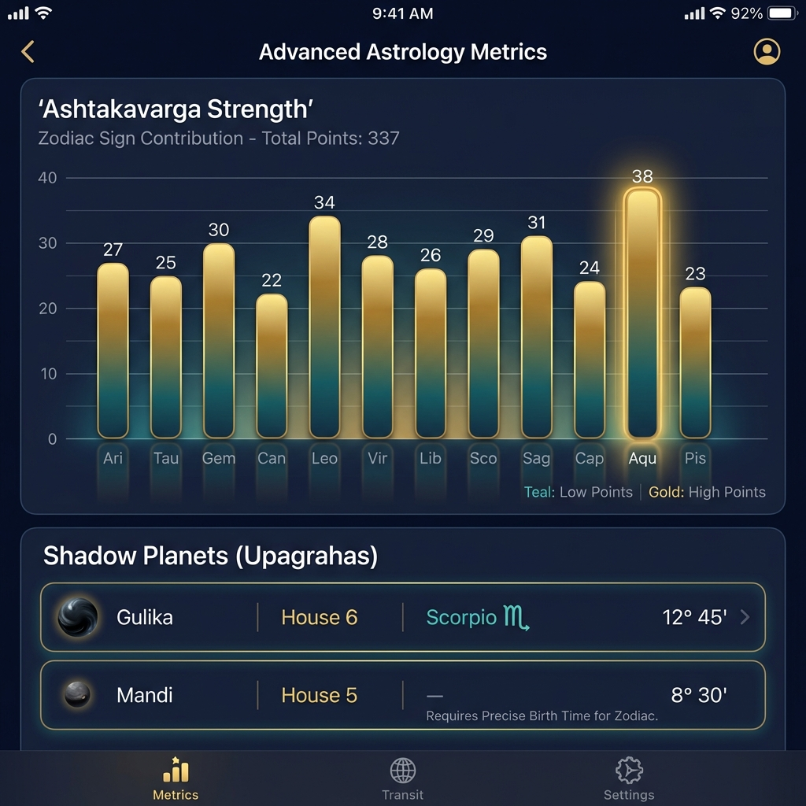
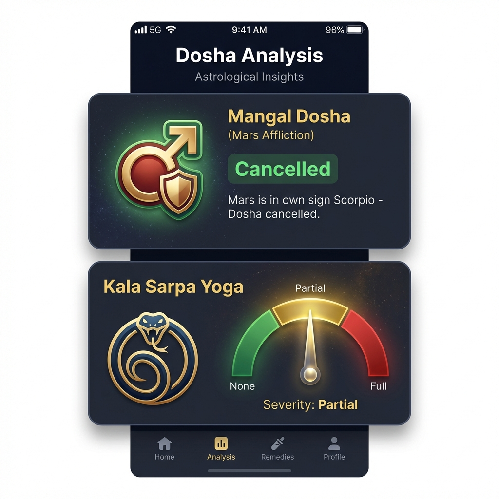

# Astrology Data UI/UX Structure & Design Guide

**Target Audience:** End Users (Premium/Modern Interface)
**Platform:** iOS (SwiftUI)
**Theme:** Cosmic/Gold/Dark (Premium)

This document groups the raw data from `astrodata/full` into logical, astrologically sound user interface modules. The goal is to progressively reveal complexity—starting with the "Big Picture" and allowing deep dives into technicals.

---

## 🏗️ Core Architecture: The "Three Pillars" Layout

For an effective astrology app, avoid dumping data. Use a **Tabbed** or **Section-Based** approach grouped by user intent:

1.  **THE BLUEPRINT (Static)** - The Birth Chart, Planets, & Strengths
2.  **THE TIMELINE (Dynamic)** - Dashas (Periods) & Transits (Current Movements)
3.  **THE ANALYSIS (Insights)** - Yogas, Doshas, & Functional Properties

## 🎨 Visual Layout Concepts

### The Dashboard (Blueprint & Timeline)

### The Analysis (Strengths & Yogas)

---

## 1. THE BLUEPRINT (Rashi & Planets)
*Data Source: `divisional_charts.D1`, `planets`, `nakshatra`, `houses`*

### A. The Chart Visual (Interactive)
The centerpiece. Do not just show a list.
*   **Visual:** North/South Indian Chart (SVG/Canvas).
*   **Data:** Use `divisional_charts.D1` for placement.
*   **Interaction:** Tap a house/planet to reveal its details popup.

### B. Planetary Positions Table (Clean List)
A consolidated view of the most frequently checked data.

*   **Layout:** Card-based list row for each planet (Sun to Ketu).
*   **Columns:**
    *   **Planet:** Icon + Name (e.g., ☀️ Sun)
    *   **Sign:** Icon + Name (e.g., ♐ Sg)
    *   **Degree:** Degree° Minute' (e.g., 04° 22')
    *   **Nakshatra:** Star Name + Pada (e.g., Moola-2)
    *   **House:** House Number (e.g., 10th)
*   **Decorations (Badges):**
    *   🔥 **Combust** (if `planets[x].is_combust`)
    *   🔙 **Retro** (if `planets[x].is_retrograde`)
    *   👑 **Exalted/Own** (from `dignity`)

### C. The "Varga" Matrix (Divisional Deep Dive)
*Data Source: `divisional_charts` (D9, D10, etc.)*
*   **UI:** A horizontal scrollable selector for charts (D1, D9, D10...).
*   **Default:** D1 (Rashi) & D9 (Navamsa) are the "King & Queen".
*   **Display:** When D9 is selected, update the Visual Chart and Table.

---

## 2. THE TIMELINE (When will it happen?)
*Data Source: `dasha` (via `get_current_dasha`), `transits`*

### A. The "Vimshottari" Clock
Astrology is about *time*.
*   **Header:** "Current Period: [Mahadasha] / [Antardasha]"
*   **Visual:** A progress bar or circular ring showing how much time is left in the current Antardasha.
*   **List:** Expandable list of future periods (Mahadasha -> Antardasha).
*   **Insight:** "You are in a Venus period (Art/Love) until Oct 2025."

### B. Planetary Transits (Live Sky)

*   **Visual:** "Where are they now?"
*   **Comparison:** Show Transit Planet vs. Natal Moon (Gochar).
*   **Highlight:**
    *   🪐 **Saturn (Sade Sati):** Alert if Saturn is 12th, 1st, or 2nd from Natal Moon.
    *   🌟 **Jupiter Return:** Alert if Transit Jupiter = Natal Jupiter sign.

---

## 3. THE ANALYSIS (The "Why")
*Data Source: `strength`, `states`, `analysis`*

### A. Strengths Meter (Shadbala)
How capable is the planet?
*   **UI:** Progress bars (0-100% or relative).
*   **Grouping:**
    *   **Strong (> 100%):** Green/Gold glow.
    *   **Weak (< 100%):** Dimmed/Gray.
*   **Data:** `strength.shadbala[planet].pct`

### B. Mood Ring (Avasthas)
How does the planet *feel*?
*   **UI:** Emoji/Status badges next to planet name.
    *   😴 **Sleeping (Sayana):** Inactive results.
    *   👁️ **Awake (Jagrata):** Full results.
    *   😊 **Delighted (Mudita):** Happy results.
    *   😡 **Angry (Kopa):** Conflict results.
*   **Data:** `states.avasthas`

### C. Special Combinations (Yogas)
The "Special Powers" of the chart.
*   **UI:** List of Cards.
*   **Card Content:**
    *   **Title:** Yoga Name (e.g., "Gaja Kesari Yoga").
    *   **Effect:** "Fame and Wisdom".
    *   **Planets:** "Jupiter + Moon".
    *   **Strength:** Star rating based on `strength` (0-1.0).
*   **Categories:**
    *   ✨ **Auspicious (Yogas):** Royal, Wealth, Wisdom.
    *   ⚠️ **Challenging (Doshas):** Mangal Dosha, Sade Sati, Kala Sarpa.

---

## 5. DEEP DIVE (The Astrologer's Toolkit)
*Data Source: `other`, `strength`, `analysis`*
For the advanced user who wants to look under the hood.

### A. The "Points" System (Ashtakavarga)
*Data Source: `other.ashtakavarga`*
*   **Visual:** 12-Bar Chart (Aries to Pisces).
*   **Data:** SAV (Sarvashtakavarga) points per sign.
*   **Insight:** "High points (30+) indicate strong areas of life."

### B. Shadow Planets (Upagrahas)
*Data Source: `other.upgrahas`*
*   **UI:** Simple list table.
*   **Columns:** Name (e.g., Gulika), Sign, House.
*   **Use Case:** Critical for medical and prashna astrology.

### C. Karmic Index (D60 Shashtyamsa)
*Data Source: `other.d60_amsa`*
*   **UI:** Detail List.
*   **Content:** Planet + Devata Name (e.g., "Amrita") + Nature (Benevolent/Cruel).

### D. Specific Dosha Checkers
*Data Source: `analysis.mangal_dosha`, `analysis.kala_sarpa`*

*   **Mangal Dosha Card:**
    *   **Status:** "Present" (Red) / "Absent" (Green) / "Cancelled" (Orange).
    *   **Reason:** "Mars in 7th House".
*   **Kala Sarpa Card:**
    *   **Type:** e.g., "Ananta Kala Sarpa".
    *   **Severity:** Visual Gauge.

---

## Recommended Hierarchy for iOS Profile View
1.  **Header:** Name, Ascendant Sign (e.g., "Libra Ascendant"), Nakshatra.
2.  **Section 1: Planetary Status** (Table from 1B).
3.  **Section 2: Current Dasha** (Timeline from 2A).
4.  **Section 3: Key Yogas** (Highlights from 3C - Top 3 strongest).
5.  **Navigation Links** (Drill down):
    *   "View Full Chart" (Opens 1A).
    *   "Strength Analysis" (Opens 3A).
    *   "Divisional Charts" (Opens 1C).
    *   "Advanced Metrics" (Opens 5A-D).

---

## Technical Mapping (JSON -> UI)

| UI Element | JSON Path | Notes |
| :--- | :--- | :--- |
| **Ascendant** | `planets.Ascendant.sign` | Use `code` (e.g. "Li") to map to "Libra" |
| **Planet Degree** | `planets[Code].degree` | Display as `deg % 30` (0-30°) |
| **Retrograde** | `planets[Code].is_retrograde` | Show 'R' symbol |
| **D9 Sign** | `divisional_charts.D9[Code].sign` | For Navamsa position |
| **Strength %** | `strength.shadbala[Code].pct` | >100% is good |
| **Yoga Name** | `analysis.yogas[i].name` | Display title |
| **Current Dasha** | *Requires `get_current_dasha` tool* | Fetch dynamically |
| **Mangal Dosha** | `analysis.mangal_dosha.has_mangal_dosha` | Boolean flag |
| **SAV Points** | `other.ashtakavarga.sav[i]` | Array of 12 integers |
| **Gulika House** | `other.upgrahas.Gulika.house` | House placement for Gulika |
| **D60 Devata** | `other.d60_amsa[Code].devata` | Karmic deity name |
| **Vimsopaka** | `strength.vimsopaka[Code].score` | 20-point strength scale |

---

*This layout respects the "Astrologer's Eye" - scanning the Rashi (D1), checking the Strength (Shadbala), verifying the Timeline (Dasha), and consulting the specialized points (Ashtakavarga).*
