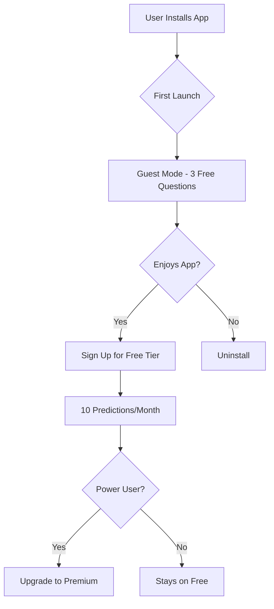

# DESTINY AI ASTROLOGY
## iOS Development Implementation Plan
### Complete Reference Guide & Development Bible

> **Version:** 1.0  
> **Last Updated:** December 23, 2025  
> **Status:** Ready for Development

---

## 📚 Table of Contents

### [PART I: PROJECT OVERVIEW](#part-i-project-overview)
- [1. Executive Summary](#1-executive-summary)
- [2. App Vision & User Tiers](#2-app-vision--user-tiers)
- [3. Technology Stack](#3-technology-stack)

### [PART II: DESIGN REFERENCE](#part-ii-design-reference)
- [4. UI/UX Design System](#4-uiux-design-system)
- [5. Screen Specifications (All 11 Screens)](#5-screen-specifications-all-11-screens)
- [6. Navigation Architecture](#6-navigation-architecture)

### [PART III: BACKEND INTEGRATION](#part-iii-backend-integration)
- [7. API Architecture](#7-api-architecture)
- [8. Data Models & Response Parsing](#8-data-models--response-parsing)

### [PART IV: DEVELOPMENT METHODOLOGY](#part-iv-development-methodology)
- [9. TDD Strategy & Testing](#9-tdd-strategy--testing)
- [10. Project Structure](#10-project-structure)
- [11. Code Quality Standards](#11-code-quality-standards)

### [PART V: CI/CD & DEPLOYMENT](#part-v-cicd--deployment)
- [12. Git Workflow](#12-git-workflow)
- [13. GitHub Actions Pipeline](#13-github-actions-pipeline)
- [14. Code Signing & Certificates](#14-code-signing--certificates)
- [15. App Store Submission](#15-app-store-submission)

### [PART VI: IMPLEMENTATION ROADMAP](#part-vi-implementation-roadmap)
- [16. Prerequisites Checklist](#16-prerequisites-checklist)
- [17. Phase-by-Phase Development Plan](#17-phase-by-phase-development-plan)
- [18. Progress Tracking](#18-progress-tracking)

### [APPENDICES](#appendices)
- [A. API Request/Response Examples](#appendix-a-api-requestresponse-examples)
- [B. Test Data & Test Cases](#appendix-b-test-data--test-cases)
- [C. Troubleshooting Guide](#appendix-c-troubleshooting-guide)
- [D. Glossary](#appendix-d-glossary)

---

# PART I: PROJECT OVERVIEW

## 1. Executive Summary

### 1.1 Project Goals

**Destiny AI Astrology** is an AI-powered Vedic astrology iOS application that provides:
- Personalized astrological predictions using birth chart analysis
- Relationship compatibility matching (Ashtakoot)
- Conversational AI interface for natural language queries
- Complete prediction history and chat management

### 1.2 Key Differentiators

| Feature | Benefit |
|---------|---------|
| **AI-Powered** | Natural language queries, not rigid forms |
| **Vedic Tradition** | Authentic calculation using 23 specialized tools |
| **ChatGPT Integration** | Conversational, context-aware responses |
| **Complete History** | All predictions saved and searchable |

### 1.3 Target Platforms

- **Primary:** iOS 17.0+
- **Devices:** iPhone (optimized for iPhone 15 Pro)
- **Future:** iPad, Apple Watch (planned)

### 1.4 Development Timeline (Estimated)

```
Phase 0: TDD Setup          → 2 days
Phase 1: Foundation         → 3 days
Phase 2: Authentication     → 2 days
Phase 3: Core Screens       → 4 days
Phase 4: Predictions        → 5 days
Phase 5: History & Profile  → 3 days
Phase 6: Polish & Testing   → 3 days
Phase 7: Deployment         → 2 days
────────────────────────────────────
Total: ~24 days (1 month sprint)
```

---

## 2. App Vision & User Tiers

### 2.1 User Tiers & Quotas

| Tier | Monthly Predictions | Compatibility Matches | Features | Price |
|------|---------------------|----------------------|----------|-------|
| **Guest** | 3 | 1 | Home view only, no history saved | Free |
| **Free** (signed in) | 10 | 3 | History, basic features | Free |
| **Premium** | Unlimited | Unlimited | All features, priority support | $4.99/mo |

### 2.2 Quota Management

#### How Quota Works:
1. **Guest tries Ask/Match** → Show sign-up prompt after 3 questions
2. **Free user hits limit** → Show upgrade to Premium modal
3. **Premium user** → No limits, all features unlocked

#### Quota UI (Home Screen):
```
┌─────────────────────────────────┐
│ 🔮 3/10 questions remaining     │
│ ━━━━━━━━━░░░░░░                 │
│ Renews Jan 21                   │
└─────────────────────────────────┘
```

#### Limit Reached Prompt:
```
┌─────────────────────────────────┐
│                                 │
│      You've used all your       │
│      free questions! 🌟         │
│                                 │
│   Upgrade to Premium for        │
│   unlimited cosmic insights.    │
│                                 │
│   [  Upgrade - $4.99/mo  ]      │
│                                 │
│        Maybe later              │
│                                 │
└─────────────────────────────────┘
```

### 2.3 Monetization Strategy



**Conversion Funnel Target:**
- Guest → Free: 30%
- Free → Premium: 10%
- **Target:** 3% overall conversion rate

---

## 3. Technology Stack

### 3.1 Core Technologies

| Category | Technology | Version | Justification |
|----------|------------|---------|---------------|
| **Language** | Swift | 5.9+ | Modern, type-safe, Apple-native |
| **UI Framework** | SwiftUI | iOS 17+ | Declarative, less code, hot reload |
| **Architecture** | MVVM | N/A | Testable, clear separation |
| **Networking** | URLSession | Native | No dependencies for MVP |
| **Persistence** | SwiftData | iOS 17+ | Modern, SwiftUI-native ORM |
| **Testing** | XCTest | Native | First-class Apple support |

### 3.2 Dependencies (Minimal for MVP)

**Zero External Dependencies**
- ✅ All features use native Apple frameworks
- ✅ Reduces app size and complexity
- ✅ Faster builds and fewer compatibility issues

**Future Considerations (Post-MVP):**
- Alamofire (if URLSession becomes limiting)
- Kingfisher (for image caching if needed)
- SwiftLint (code quality enforcement)

### 3.3 Backend API

| Component | Technology | URL |
|-----------|------------|-----|
| **Production** | FastAPI + Python | `https://astroapi-v2-668639087682.asia-south1.run.app` |
| **Development** | Local FastAPI | `http://localhost:8000` |
| **Database** | PostgreSQL | Cloud SQL (production), SQLite (local) |
| **LLM** | OpenAI GPT-4o-mini | Configured in backend |

### 3.4 Development Tools

```
┌─────────────────────────────────────┐
│ Development Environment             │
├─────────────────────────────────────┤
│ • Xcode 15.2+                       │
│ • macOS Sonoma 14.0+                │
│ • iPhone 15 Pro Simulator           │
│ • iOS 17.2+ SDK                     │
└─────────────────────────────────────┘

┌─────────────────────────────────────┐
│ Version Control                     │
├─────────────────────────────────────┤
│ • Git 2.x                           │
│ • GitHub (repository host)          │
│ • GitHub Actions (CI/CD)            │
└─────────────────────────────────────┘

┌─────────────────────────────────────┐
│ Design & Prototyping                │
├─────────────────────────────────────┤
│ • Figma (mockups)                   │
│ • SF Symbols (icons)                │
│ • Xcode Previews (rapid iteration)  │
└─────────────────────────────────────┘
```

### 3.5 API Authentication

**Header:** `X-API-KEY`  
**Verified Key:** `astro_ios_G5iY3-1Z7ymE46hYwKTbK1bSz2x5Vn4BeymPOvyy3ic`  
**Owner:** `prabhukushwaha@gmail.com`  
**Status:** ✅ Tested and working on local API

---

**[Continue to Part II: Design Reference →](#part-ii-design-reference)**


# PART II: DESIGN REFERENCE

## 4. UI/UX Design System

### 4.1 Color Palette

| Color | Hex | Usage |
|-------|-----|-------|
| **Navy** | `#1a237e` | Primary buttons, headers |
| **White** | `#ffffff` | Backgrounds, text on dark |
| **Gold** | `#ffd700` | Accents, highlights, planets |
| **Light Gray** | `#f5f5f5` | Card backgrounds |
| **Dark Gray** | `#333333` | Body text |
| **Error Red** | `#d32f2f` | Error states |
| **Success Green** | `#388e3c` | Confirmation states |

### 4.2 Typography

```swift
// System Fonts
Title: SF Pro Display, 28pt, Bold
Heading: SF Pro Display, 20pt, Semibold
Body: SF Pro Text, 16pt, Regular
Caption: SF Pro Text, 14pt, Regular
```

### 4.3 Spacing System

```swift
// Consistent spacing multipliers
xs: 4pt
sm: 8pt
md: 16pt
lg: 24pt
xl: 32pt
xxl: 48pt
```

### 4.4 Component Library

**Buttons:**
```swift
Primary: Navy background, white text, rounded 12pt
Secondary: White background, navy border, navy text
Destructive: Red background, white text
```

**Cards:**
```swift
Background: White/Light gray
Border radius: 16pt
Shadow: 0 2px 8px rgba(0,0,0,0.1)
Padding: 16pt
```

**Input Fields:**
```swift
Border: 1pt solid light gray
Focused: Navy border
Height: 48pt
Padding: 12pt horizontal
```

---

## 5. Screen Specifications (All 11 Screens)

### 5.1 Splash Screen

**Purpose:** App launch animation, route to onboarding or home

```
┌─────────────────────────────────┐
│                                 │
│                                 │
│                                 │
│            D destiny            │
│          ━━━━━━━━━━━           │
│                                 │
│                                 │
│                                 │
│           Loading...            │
│                                 │
└─────────────────────────────────┘
```

**State Management:**
```swift
@State private var isLoading = true
@AppStorage("hasSeenOnboarding") var hasSeenOnboarding = false

// Logic
if isLoading {
    SplashView()
} else if !hasSeenOnboarding {
    OnboardingView()
} else {
    HomeView()
}
```

**Duration:** 2 seconds max

---

### 5.2 Onboarding (4 Slides)

**Slide 1: Welcome**
```
┌─────────────────────────────────┐
│                                 │
│            ◎ (GPT logo)         │
│                                 │
│    ChatGPT Store's most loved   │
│    astrology app now on the     │
│           App Store             │
│                                 │
│  ┌─────────────────────────┐    │
│  │ ◎ 300K+ conversations   │    │
│  │ ⭐⭐⭐⭐ 4.0 rating      │    │
│  └─────────────────────────┘    │
│                                 │
│ Skip              ○ ○ ○ ○       │
└─────────────────────────────────┘
```

**Slide 2: What is Destiny**
```
┌─────────────────────────────────┐
│                                 │
│              D>                 │
│                                 │
│     What is Destiny AI          │
│        Astrology?               │
│                                 │
│  Destiny is a personal space    │
│  to understand patterns in      │
│  your life. It combines         │
│  astrology with AI to help      │
│  you reflect, ask better        │
│  questions, and see             │
│  situations more clearly.       │
│                                 │
│ Skip   [Continue >]   ● ○ ○ ○   │
└─────────────────────────────────┘
```

**Slide 3: How it Works**
```
┌─────────────────────────────────┐
│                                 │
│             🔭                  │
│                                 │
│      How Destiny delivers       │
│       personal insights         │
│                                 │
│  Astrology is shaped by         │
│  thousands of interacting       │
│  variables. Destiny's system    │
│  analyses these patterns        │
│  together, instead of           │
│  isolating traits - allowing    │
│  it to respond with context,    │
│  nuance, and timing.            │
│                                 │
│ Skip   [Continue >]   ○ ● ○ ○   │
└─────────────────────────────────┘
```

**Slide 4: Features**
```
┌─────────────────────────────────┐
│                                 │
│   Here's what you can do        │
│                                 │
│ ⚫ Ask Me Anything              │
│   Ask questions about your day  │
│   and get real-time guidance.   │
│                                 │
│ ❤️ Compatibility / Match        │
│   Compare two birth charts.     │
│                                 │
│ 💬 Chat History                 │
│   Revisit past insights.        │
│                                 │
│ ✅ Higher Accuracy              │
│   Context-aware responses.      │
│                                 │
│      [  Get started  ]          │
└─────────────────────────────────┘
```

**State:**
```swift
@State private var currentSlide = 0
let totalSlides = 4
```

---

### 5.3 Authentication Screen

**Layout:**
```
┌─────────────────────────────────┐
│                                 │
│            D destiny            │
│                                 │
│      Welcome to Destiny         │
│   Your personal astrology       │
│          companion              │
│                                 │
│  ┌─────────────────────────┐    │
│  │  ⍟ Sign in with Apple   │    │
│  └─────────────────────────┘    │
│                                 │
│  ┌─────────────────────────┐    │
│  │  G Sign in with Google  │    │
│  └─────────────────────────┘    │
│                                 │
│  ┌─────────────────────────┐    │
│  │  ✉ Sign in with Email   │    │
│  └─────────────────────────┘    │
│                                 │
│      [Continue as Guest]        │
│                                 │
│     By continuing, you agree    │
│     to our Terms and Privacy    │
│                                 │
└─────────────────────────────────┘
```

**Navigation:**
- Sign in → Birth Data (if new user) → Home
- Continue as Guest → Home (limited features)

**Guest Limitations:**
- 3 predictions max
- 1 compatibility check
- No history saved
- Prompted to sign in for full features

---

### 5.4 Birth Data Screen

**Purpose:** Collect user's astrological birth information

```
┌─────────────────────────────────┐
│ < Back                          │
│                                 │
│      Tell us about yourself     │
│   Enter your birth details so   │
│   we can create your profile.   │
│                                 │
│  📅 Date of birth               │
│  ┌─────────────────────────┐    │
│  │ Select date   April 20, 1996>│
│  └─────────────────────────┘    │
│                                 │
│  🕐 Time of birth               │
│  ┌─────────────────────────┐    │
│  │ Select time       4:45 AM >  │
│  └─────────────────────────┘    │
│                                 │
│  📍 Location of birth           │
│  ┌─────────────────────────┐    │
│  │ Enter...    Los Angeles, CA >│
│  └─────────────────────────┘    │
│                                 │
│  ⊕ Gender                       │
│  ┌─────────────────────────┐    │
│  │ Select gender      Female >  │
│  └─────────────────────────┘    │
│                                 │
│  ┌─────────────────────────┐    │
│  │          Next                │
│  └─────────────────────────┘    │
│  ✨ [Cosmic starry background]  │
└─────────────────────────────────┘
```

**Data Model:**
```swift
struct BirthData: Codable {
    var dob: String        // "1996-04-20"
    var time: String       // "04:45"
    var latitude: Double   // 34.0522
    var longitude: Double  // -118.2437
    var cityOfBirth: String
    var gender: String     // Optional
}
```

**Validation:**
- All fields required except gender
- Date: Cannot be in future
- Time: 24-hour format internally
- Location: Use geocoding API for lat/long

---

### 5.5 Home Screen

**Layout:**
```
┌─────────────────────────────────┐
│ ☰           D destiny        👤 │
│                                 │
│  Hey Vamshi,                    │
│  Let's look at today.           │
│                                 │
│  ┌─ Quota ─────────────────┐    │
│  │ 🔮 7/10 questions left  │    │
│  │ ━━━━━━━━━░░░  Renews Jan│    │
│  └─────────────────────────┘    │
│                                 │
│  ┌─────────────────────────┐    │
│  │ You're more sensitive   │    │
│  │ to tone than words      │    │
│  │ today.                  │    │
│  └─────────────────────────┘    │
│                                 │
│  ┌─────────────────────────┐    │
│  │ What should I be mindful│    │
│  │ of in conversations?   >│    │
│  └─────────────────────────┘    │
│                                 │
│     ○ ~~~~ ○ ~~~~              │
│    [Golden planets on orbits]   │
│                                 │
├─────────────────────────────────┤
│  🏠      ┌───────┐      ❤️     │
│ Home     │  Ask  │     Match    │
│          └───────┘              │
└─────────────────────────────────┘
```

**Components:**
1. **Header:** Menu (☰), Logo, Profile (👤)
2. **Greeting:** Personalized with name
3. **Quota Widget:** Shows remaining questions (Free tier only)
4. **Insight Cards:** Daily astrological insights
5. **Suggested Questions:** Tap to open chat
6. **Planetary Animation:** Visual decoration
7. **Tab Bar:** Home, Ask (FAB), Match

**State:**
```swift
@State private var userName: String
@State private var quotaRemaining: Int
@State private var dailyInsight: String
@State private var suggestedQuestions: [String]
```

---

### 5.6 Chat Screen (Ask)

**Layout:**
```
┌─────────────────────────────────┐
│ < Back      D destiny        👤 │
│                                 │
│  ┌─────────────────────────┐    │
│  │ 🧙 Based on your chart, │    │
│  │ Mercury in the 3rd house│    │
│  │ suggests heightened     │    │
│  │ sensitivity today...    │    │
│  └─────────────────────────┘    │
│                                 │
│         ┌──────────────────┐    │
│         │ What about my    │    │
│         │ career?          │    │
│         └──────────────────┘    │
│                                 │
│                          [+]    │
│  ┌─────────────────────────┐    │
│  │ Type your question... ➤ │    │
│  └─────────────────────────┘    │
├─────────────────────────────────┤
│  🏠      ┌───────┐      ❤️     │
│ Home     │  Ask  │     Match    │
└─────────────────────────────────┘
```

**Features:**
- **Streaming responses:** Show typing indicator
- **Message bubbles:** AI (left), User (right)
- **FAB [+]:** Start new chat thread
- **Input field:** Multiline support, send button
- **History:** Load previous conversation

**API Integration:**
```swift
// POST /vedic/api/predict/
func sendMessage(_ query: String) async throws {
    let request = PredictionRequest(
        query: query,
        birth_data: currentUser.birthData,
        session_id: sessionID,
        platform: "ios"
    )
    let response = try await predictionService.predict(request)
    appendMessage(response.answer)
}
```

---

### 5.7 Compatibility Screen (Match)

**Input Form:**
```
┌─────────────────────────────────┐
│       Match Compatibility       │
│                                 │
│     Discover your connection    │
│   Compare birth charts to see   │
│   how your stars align together │
│                                 │
│ ┌──────────────┬──────────────┐ │
│ │ Boy Details  │ Girl Details │ │
│ └──────────────┴──────────────┘ │
│                                 │
│  BOY'S NAME                     │
│  ┌─────────────────────────┐    │
│  │ Vamshi                  │    │
│  └─────────────────────────┘    │
│                                 │
│  DATE OF BIRTH    TIME          │
│  ┌───────────┐ ┌───────────┐    │
│  │ 1994-07-01│ │   00:15   │    │
│  └───────────┘ └───────────┘    │
│                                 │
│  PLACE OF BIRTH                 │
│  ┌─────────────────────────┐    │
│  │ Karimnagar              │    │
│  └─────────────────────────┘    │
│                          [+]    │
│  ┌─────────────────────────┐    │
│  │    Analyze Match ✨      │    │
│  └─────────────────────────┘    │
├─────────────────────────────────┤
│  🏠      ┌───────┐      ❤️     │
│ Home     │  Ask  │     Match    │
└─────────────────────────────────┘
```

**Result View:**
```
┌─────────────────────────────────┐
│ < Back    Match Result          │
│                                 │
│  ┌─────────┐    ┌─────────┐     │
│  │ ♂ Vamshi│ VS │ ♀ Swathi│     │
│  └─────────┘    └─────────┘     │
│                                 │
│        ╭─────────────╮          │
│       ╱      28       ╲         │
│      │   ━━━━━━━━━   │         │
│       ╲   out of 36  ╱          │
│        ╰─────────────╯          │
│                                 │
│  Kuta Grid:                     │
│  Varna 8/8 │ Vashya 5/6         │
│  Tara 3/3  │ Yoni 4/4           │
│                                 │
│  AI Interpretation chat...      │
│                                 │
├─────────────────────────────────┤
│  🏠      ┌───────┐      ❤️     │
│ Home     │  Ask  │     Match    │
└─────────────────────────────────┘
```

**API:**
```swift
// POST /vedic/api/compatibility/analyze
struct CompatibilityRequest {
    let partner1_birth_data: BirthData
    let partner2_birth_data: BirthData
}

struct CompatibilityResponse {
    let ashtakoot: AshtakootScores
    let ai_interpretation: String
}
```

---

### 5.8 History Screen

**Layout:**
```
┌─────────────────────────────────┐
│            Chat History         │
│                                 │
│  Today                          │
│  ┌─────────────────────────┐    │
│  │ 🔮 Career guidance 2025 │ 2h │
│  │ Moderate growth...      │    │
│  └─────────────────────────┘    │
│                                 │
│  ┌─────────────────────────┐    │
│  │ 💕 Match: Vamshi&Swathi │ 5h │
│  │ 28/36 - Excellent       │    │
│  └─────────────────────────┘    │
│                                 │
│  Yesterday                      │
│  ┌─────────────────────────┐    │
│  │ 🔮 Marriage prediction  │ 1d │
│  │ Strong 2025 indications │    │
│  └─────────────────────────┘    │
│                                 │
│                                 │
├─────────────────────────────────┤
│  🏠      ┌───────┐      ❤️     │
│ Home     │  Ask  │     Match    │
└─────────────────────────────────┘
```

**Features:**
- **Grouping:** Today, Yesterday, This Week, Older
- **Icons:** 🔮 Prediction, 💕 Compatibility
- **Tap:** Navigate to full conversation
- **Swipe:** Delete thread
- **Search:** Filter by keyword

**API:**
```swift
// GET /chat-history/threads/{user_id}
func loadHistory() async throws -> [ChatThread] {
    return try await chatHistoryService.getThreads(userID: currentUser.id)
}
```

---

### 5.9 Charts Screen

**Layout:**
```
┌─────────────────────────────────┐
│ < Back       Birth Chart        │
│                                 │
│  ♋ Cancer Ascendant             │
│                                 │
│  PLANETARY POSITIONS            │
│  ┌─────────────────────────┐    │
│  │ ☉ Sun       Gemini      │    │
│  │ ☽ Moon      Aquarius    │    │
│  │ ☿ Mercury   Gemini      │    │
│  │ ♀ Venus     Cancer      │    │
│  │ ♂ Mars      Taurus      │    │
│  │ ♃ Jupiter   Libra       │    │
│  │ ♄ Saturn    Pisces      │    │
│  │ ☊ Rahu      Libra       │    │
│  │ ☋ Ketu      Aries       │    │
│  └─────────────────────────┘    │
│                                 │
│                                 │
├─────────────────────────────────┤
│  🏠      ┌───────┐      ❤️     │
│ Home     │  Ask  │     Match    │
└─────────────────────────────────┘
```

**Future Enhancement:** Visual birth chart diagram

---

### 5.10 Profile Screen

**Layout:**
```
┌─────────────────────────────────┐
│ < Back         Profile          │
│                                 │
│          👤 [Crown]             │
│           Vamshi                │
│       vamshi@email.com          │
│                                 │
│  Birth Details                  │
│  ┌─────────────────────────┐    │
│  │ 🎂 Birth Details       >│    │
│  │   01 Jul 1994, 00:15 AM │    │
│  │   Karimnagar            │    │
│  └─────────────────────────┘    │
│                                 │
│  Preferences                    │
│  ┌─────────────────────────┐    │
│  │ 🔔 Astrology System   > │    │
│  │    Vedic                │    │
│  │ 🌐 Language           > │    │
│  │    English              │    │
│  └─────────────────────────┘    │
│                                 │
│  Support                        │
│  ┌─────────────────────────┐    │
│  │ ❓ Help & FAQ          >│    │
│  │ 🚪 Sign Out            >│    │
│  └─────────────────────────┘    │
├─────────────────────────────────┤
│  🏠      ┌───────┐      ❤️     │
│ Home     │  Ask  │     Match    │
└─────────────────────────────────┘
```

**Actions:**
- Edit birth details
- Change system preferences
- View help documentation
- Sign out

---

### 5.11 Subscription Screen

**Layout:**
```
┌─────────────────────────────────┐
│ < Back                          │
│                                 │
│             👑                  │
│                                 │
│      Unlock Destiny             │
│        Premium                  │
│                                 │
│  Get unlimited insights and     │
│  deeper cosmic guidance.        │
│                                 │
│  ┌─────────────────────────┐    │
│  │  $4.99 /month           │    │
│  │                         │    │
│  │  ✓ Unlimited Questions  │    │
│  │  ✓ Unlimited Matches    │    │
│  │  ✓ Advanced Charts      │    │
│  │  ✓ Ad-Free Experience   │    │
│  │                         │    │
│  │  [  Subscribe Now  ]     │   │
│  │                         │    │
│  │  Auto-renews. Cancel     │   │
│  │  anytime.                │   │
│  └─────────────────────────┘    │
│                                 │
└─────────────────────────────────┘
```

**In-App Purchase:**
```swift
// StoreKit 2
Product.SubscriptionInfo.RenewalInfo.autoRenewStatus
```

---

## 6. Navigation Architecture

### 6.1 Navigation Flow Diagram

```
App Launch
    ↓
[Splash (2s)] 
    ↓
    ├─ First Time → [Onboarding (4 slides)]
    │                      ↓
    │                [Auth Screen]
    │                 ↓          ↓
    │            Sign In    Continue as Guest
    │                 ↓              ↓
    │          [Birth Data]          │
    │                 ↓              │
    └─ Returning  →  [HOME] ←────────┘
                      ↓
        ┌─────────────┼─────────────┐
        ↓             ↓             ↓
    [History]    [Tab Bar]     [Profile]
    (via ☰)       ↓   ↓   ↓    (via 👤)
               Home Ask Match      ↓
                     ↓     ↓   [Subscription]
                  [Chat][Compat]
                           ↓
                       [Result]
```

### 6.2 Tab Bar Structure

```swift
TabView(selection: $selectedTab) {
    HomeView()
        .tabItem { Label("Home", systemImage: "house") }
        .tag(0)
    
    // Ask button (FAB style)
    ChatView()
        .tabItem { Label("Ask", systemImage: "message.fill") }
        .tag(1)
    
    CompatibilityView()
        .tabItem { Label("Match", systemImage: "heart") }
        .tag(2)
}
```

### 6.3 Deep Linking Support

```swift
// URL Schemes
destinyai://prediction/{predictionID}
destinyai://compatibility/{matchID}
destinyai://subscribe
```

---

**[Continue to Part III: Backend Integration →](#part-iii-backend-integration)**


# PART III: BACKEND INTEGRATION

## 7. API Architecture

### 7.1 Base Configuration

**Development Environment:**
```swift
#if DEBUG
static let baseURL = "http://localhost:8000"
static let apiVersion = ""
static let apiKey = "astro_ios_G5iY3-1Z7ymE46hYwKTbK1bSz2x5Vn4BeymPOvyy3ic"
#else
static let baseURL = "https://astroapi-v2-668639087682.asia-south1.run.app"
static let apiVersion = "/api/v1"
static let apiKey = "<PRODUCTION_KEY>"
#endif
```

**Authentication:**
- **Header:** `X-API-KEY`
- **Value:** API key from config
- **Local:** Auth disabled for development
- **Production:** Required for all endpoints

### 7.2 Complete Endpoint Reference

| API | Method | Endpoint | Description |
|-----|--------|----------|-------------|
| **Prediction** | POST | `/vedic/api/predict/` | Synchronous prediction |
| **Prediction Stream** | POST | `/vedic/api/predict/stream` | Real-time SSE streaming |
| **Compatibility** | POST | `/vedic/api/compatibility/analyze` | Match analysis |
| **Compatibility Stream** | POST | `/vedic/api/compatibility/analyze/stream` | Streaming match |
| **Follow-up** | POST | `/vedic/api/compatibility/follow-up` | Follow-up questions |
| **Chat History** | GET | `/chat-history/threads/{user_id}` | List threads |
| **Chat Thread** | GET | `/chat-history/threads/{user_id}/{thread_id}` | Get messages |
| **Delete Thread** | DELETE | `/chat-history/threads/{user_id}/{thread_id}` | Delete thread |
| **Search** | GET | `/chat-history/search/{user_id}?q=...` | Search history |
| **Feedback** | POST | `/feedback/submit` | Submit rating |

### 7.3 Prediction API Details

**Request:**
```json
{
  "query": "When will I get married?",
  "birth_data": {
    "dob": "1994-07-01",
    "time": "00:15",
    "latitude": 18.4386,
    "longitude": 79.1288,
    "city_of_birth": "Karimnagar",
    "ayanamsa": "lahiri",
    "house_system": "equal"
  },
  "session_id": "sess_abc123",
  "user_email": "user@example.com",
  "platform": "ios",
  "include_reasoning_trace": false
}
```

**Response:**
```json
{
  "prediction_id": "pred_abc123",
  "session_id": "sess_abc123",
  "conversation_id": "conv_xyz789",
  "status": "completed",
  "answer": "Based on 7th house analysis...",
  "answer_summary": "Marriage likely in 2025-2026",
  "timing": {
    "period": "March 2025 - August 2025",
    "dasha": "Jupiter-Venus",
    "confidence": "HIGH"
  },
  "confidence": 0.78,
  "confidence_label": "HIGH",
  "supporting_factors": ["Venus well-placed", "7th lord favorable"],
  "challenging_factors": ["Saturn aspect"],
  "follow_up_suggestions": [
    "What qualities should I look for?",
    "Any doshas affecting marriage?"
  ],
  "life_area": "marriage",
  "execution_time_ms": 3542,
  "created_at": "2024-01-15T10:30:00Z"
}
```

### 7.4 Compatibility API Details

**Request:**
```json
{
  "boy": {
    "dob": "1994-07-01",
    "time": "00:15",
    "lat": 18.4386,
    "lon": 79.1288,
    "name": "Vamshi",
    "place": "Karimnagar"
  },
  "girl": {
    "dob": "1996-04-20",
    "time": "04:45",
    "lat": 34.0522,
    "lon": -118.2437,
    "name": "Swathi",
    "place": "Los Angeles"
  },
  "user_email": "user@example.com"
}
```

**Response:**
```json
{
  "session_id": "sess_match_abc",
  "status": "completed",
  "ashtakoot": {
    "total_score": 28,
    "max_score": 36,
    "percentage": 77.8,
    "verdict": "Excellent Match",
    "kutas": [
      {"name": "Varna", "score": 1, "max": 1},
      {"name": "Vashya", "score": 2, "max": 2},
      {"name": "Tara", "score": 3, "max": 3},
      {"name": "Yoni", "score": 4, "max": 4}
    ]
  },
  "ai_interpretation": "Excellent compatibility based on...",
  "recommendations": ["Favorable muhurta: March-May 2025"],
  "execution_time_ms": 2845
}
```

### 7.5 Chat History API

**List Threads:**
```swift
GET /chat-history/threads/{user_id}

Response:
{
  "threads": [
    {
      "thread_id": "thread_123",
      "title": "Career guidance 2025",
      "preview": "Moderate growth expected...",
      "created_at": "2024-01-15T10:00:00Z",
      "message_count": 5
    }
  ]
}
```

**Get Thread Messages:**
```swift
GET /chat-history/threads/{user_id}/{thread_id}

Response:
{
  "thread_id": "thread_123",
  "messages": [
    {
      "role": "user",
      "content": "How is my career?",
      "timestamp": "2024-01-15T10:00:00Z"
    },
    {
      "role": "assistant",
      "content": "Based on your chart...",
      "timestamp": "2024-01-15T10:00:05Z",
      "prediction_id": "pred_xyz"
    }
  ]
}
```

---

## 8. Data Models & Response Parsing

### 8.1 Core Models

**BirthData.swift**
```swift
import Foundation

struct BirthData: Codable, Equatable {
    let dob: String           // "YYYY-MM-DD"
    let time: String          // "HH:MM"
    let latitude: Double
    let longitude: Double
    var cityOfBirth: String?
    var ayanamsa: String = "lahiri"
    var houseSystem: String = "equal"
    
    enum CodingKeys: String, CodingKey {
        case dob, time, latitude, longitude
        case cityOfBirth = "city_of_birth"
        case ayanamsa
        case houseSystem = "house_system"
    }
    
    // Validation
    func isValid() -> Bool {
        // Date format YYYY-MM-DD
        let dateRegex = "^\\d{4}-\\d{2}-\\d{2}$"
        guard dob.range(of: dateRegex, options: .regularExpression) != nil else {
            return false
        }
        
        // Time format HH:MM
        let timeRegex = "^\\d{2}:\\d{2}$"
        guard time.range(of: timeRegex, options: .regularExpression) != nil else {
            return false
        }
        
        // Latitude/Longitude ranges
        guard (-90...90).contains(latitude) && (-180...180).contains(longitude) else {
            return false
        }
        
        return true
    }
}
```

**PredictionModels.swift**
```swift
import Foundation

struct PredictionRequest: Codable {
    let query: String
    let birthData: BirthData
    var sessionId: String?
    var conversationId: String?
    var userEmail: String?
    var platform: String = "ios"
    var includeReasoningTrace: Bool = false
    
    enum CodingKeys: String, CodingKey {
        case query
        case birthData = "birth_data"
        case sessionId = "session_id"
        case conversationId = "conversation_id"
        case userEmail = "user_email"
        case platform
        case includeReasoningTrace = "include_reasoning_trace"
    }
}

struct PredictionResponse: Codable, Identifiable {
    let predictionId: String
    let sessionId: String
    let conversationId: String
    let status: String
    let answer: String
    let answerSummary: String?
    let timing: TimingPrediction?
    let confidence: Double
    let confidenceLabel: String
    let supportingFactors: [String]
    let challengingFactors: [String]
    let followUpSuggestions: [String]
    let lifeArea: String
    let executionTimeMs: Double
    let createdAt: String
    
    var id: String { predictionId }
    
    enum CodingKeys: String, CodingKey {
        case predictionId = "prediction_id"
        case sessionId = "session_id"
        case conversationId = "conversation_id"
        case status, answer
        case answerSummary = "answer_summary"
        case timing, confidence
        case confidenceLabel = "confidence_label"
        case supportingFactors = "supporting_factors"
        case challengingFactors = "challenging_factors"
        case followUpSuggestions = "follow_up_suggestions"
        case lifeArea = "life_area"
        case executionTimeMs = "execution_time_ms"
        case createdAt = "created_at"
    }
}

struct TimingPrediction: Codable {
    let period: String?
    let dasha: String?
    let transit: String?
    let confidence: String
}
```

**CompatibilityModels.swift**
```swift
struct CompatibilityRequest: Codable {
    let boy: BirthDetails
    let girl: BirthDetails
    var sessionId: String?
    var userEmail: String?
    
    enum CodingKeys: String, CodingKey {
        case boy, girl
        case sessionId = "session_id"
        case userEmail = "user_email"
    }
}

struct BirthDetails: Codable {
    let dob: String
    let time: String
    let lat: Double
    let lon: Double
    var name: String = "Native"
    var place: String = "Unknown"
}

struct CompatibilityResponse: Codable {
    let sessionId: String
    let status: String
    let ashtakoot: AshtakootScores
    let aiInterpretation: String
    let recommendations: [String]
    let executionTimeMs: Double
    
    enum CodingKeys: String, CodingKey {
        case sessionId = "session_id"
        case status, ashtakoot
        case aiInterpretation = "ai_interpretation"
        case recommendations
        case executionTimeMs = "execution_time_ms"
    }
}

struct AshtakootScores: Codable {
    let totalScore: Int
    let maxScore: Int
    let percentage: Double
    let verdict: String
    let kutas: [KutaScore]
    
    enum CodingKeys: String, CodingKey {
        case totalScore = "total_score"
        case maxScore = "max_score"
        case percentage, verdict, kutas
    }
}

struct KutaScore: Codable, Identifiable {
    let name: String
    let score: Int
    let max: Int
    let description: String?
    
    var id: String { name }
}
```

### 8.2 Network Service Layer

**NetworkClient.swift**
```swift
import Foundation

enum NetworkError: Error {
    case invalidURL
    case noData
    case decodingError(Error)
    case serverError(String)
    case unauthorized
}

protocol NetworkClientProtocol {
    func request<T: Decodable>(
        endpoint: String,
        method: String,
        body: Encodable?
    ) async throws -> T
}

class NetworkClient: NetworkClientProtocol {
    private let baseURL: String
    private let apiKey: String?
    
    init(baseURL: String, apiKey: String? = nil) {
        self.baseURL = baseURL
        self.apiKey = apiKey
    }
    
    func request<T: Decodable>(
        endpoint: String,
        method: String = "GET",
        body: Encodable? = nil
    ) async throws -> T {
        guard let url = URL(string: baseURL + endpoint) else {
            throw NetworkError.invalidURL
        }
        
        var request = URLRequest(url: url)
        request.httpMethod = method
        request.setValue("application/json", forHTTPHeaderField: "Content-Type")
        
        if let apiKey = apiKey {
            request.setValue(apiKey, forHTTPHeaderField: "X-API-KEY")
        }
        
        if let body = body {
            request.httpBody = try JSONEncoder().encode(body)
        }
        
        let (data, response) = try await URLSession.shared.data(for: request)
        
        guard let httpResponse = response as? HTTPURLResponse else {
            throw NetworkError.noData
        }
        
        guard (200...299).contains(httpResponse.statusCode) else {
            if httpResponse.statusCode == 401 {
                throw NetworkError.unauthorized
            }
            let errorMessage = String(data: data, encoding: .utf8) ?? "Unknown error"
            throw NetworkError.serverError(errorMessage)
        }
        
        do {
            let decoded = try JSONDecoder().decode(T.self, from: data)
            return decoded
        } catch {
            throw NetworkError.decodingError(error)
        }
    }
}
```

**PredictionService.swift**
```swift
protocol PredictionServiceProtocol {
    func predict(request: PredictionRequest) async throws -> PredictionResponse
}

class PredictionService: PredictionServiceProtocol {
    private let networkClient: NetworkClientP rotocol
    
    init(networkClient: NetworkClientProtocol) {
        self.networkClient = networkClient
    }
    
    func predict(request: PredictionRequest) async throws -> PredictionResponse {
        return try await networkClient.request(
            endpoint: APIConfig.predict,
            method: "POST",
            body: request
        )
    }
}
```

---


# PART VI: IMPLEMENTATION ROADMAP

## 16. Prerequisites Checklist

> **IMPORTANT:** Complete ALL items below before starting iOS development.

### ✅ Prerequisites Status

| # | Category | Items | Status |
|---|----------|-------|--------|
| 1 | **Design Assets** | App Icon, Logo, Colors | ⏳ Partial |
| 2 | **API Configuration** | Base URL, Authentication | ✅ **DONE** |
| 3 | **Test Data** | API Key, Birth Data, Queries | ✅ **DONE** |
| 4 | **Development Environment** | Xcode 15+, iOS 17 SDK | ⏳ Verify |
| 5 | **Dependencies** | None (Native Swift) | ✅ **DONE** |
| 6 | **Testing** | API Health Check | ✅ **DONE** |
| 7 | **UserDefaults Keys** | Defined schema | ✅ **DONE** |
| 8 | **SwiftData Models** | Schema defined | ✅ **DONE** |
| 9 | **Project Structure** | Folders created | ⏳ **TODO** |

### Detailed Prerequisites

#### 1. Design Assets

```bash
[ ] App Icon (1024x1024 PNG)
[✅] Logo (logo_s.png from mockup)
[✅] Color Palette defined
[ ] Export watercolor texture for splash
```

#### 2. API Configuration ✅

**Verified URLs:**
- Local: `http://localhost:8000` ✅
- Production: `https://astroapi-v2-668639087682.asia-south1.run.app` ✅

**API Key (Local):**
```
Key: astro_ios_G5iY3-1Z7ymE46hYwKTbK1bSz2x5Vn4BeymPOvyy3ic
Key ID: C-YuKP6ppBPVnhJJuBRTiw
Owner: prabhukushwaha@gmail.com
```

#### 3. Test Data ✅

**Sample Birth Data:**
```json
{
  "dob": "1994-07-01",
  "time": "00:15",
  "latitude": 18.4386,
  "longitude": 79.1288,
  "city_of_birth": "Karimnagar"
}
```

**Sample Queries:**
- "When will I get married?"
- "How is my career in 2025?"
- "Tell me about my health"

#### 4. Development Environment

**Requirements:**
- macOS Sonoma 14.0+
- Xcode 15.2+
- iPhone 15 Pro Simulator
- iOS 17.2 SDK

**Verification:**
```bash
xcodebuild -version
# Expected: Xcode 15.X
```

#### 9. Project Structure Setup

**Create folders:**
```bash
cd ios_app/ios_app/
mkdir -p Models Services ViewModels Views Components
mkdir Views/{Splash,Onboarding,Auth,Home,Chat,Compatibility,History,Profile}
```

---

## 17. Phase-by-Phase Development Plan

### Phase 0: TDD Setup & Project Foundation (2 days)

**Goal:** Establish testing infrastructure before writing production code

#### Tasks:
1. **Create Test Target**
   ```bash
   - Open Xcode project
   - File → New → Target → Unit Testing Bundle
   - Name: ios_appTests
   ```

2. **Setup Mock Services**
   ```swift
   // ios_appTests/Mocks/MockPredictionService.swift
   class MockPredictionService: PredictionServiceProtocol {
       var mockResponse: Result<PredictionResponse, Error>?
       
       func predict(request: PredictionRequest) async throws -> PredictionResponse {
           switch mockResponse {
           case .success(let response):
               return response
           case .failure(let error):
               throw error
           case .none:
               throw NetworkError.noData
           }
       }
   }
   ```

3. **Write First Tests**
   ```swift
   // BirthDataTests.swift
   func testBirthDataValidation() {
       let validData = BirthData(dob: "1994-07-01", time: "00:15", ...)
       XCTAssertTrue(validData.isValid())
   }
   ```

4. **Verify CI/CD**
   - Create `.github/workflows/ios-ci.yml`
   - Push to GitHub
   - Confirm tests run on CI

**Deliverables:**
- [✅] Test target configured
- [✅] Mock services created
- [✅] First 3 tests passing
- [✅] CI pipeline green

---

### Phase 1: Foundation - Models & Services (3 days)

**Goal:** Build core data layer with 100% test coverage

#### Day 1: Models (TDD)

**Write Tests First:**
```swift
// BirthDataTests.swift
func testBirthDataCodable() { ... }
func testBirthDataValidation() { ... }
func testInvalidDateFormat() { ... }
```

**Implement Models:**
```swift
// Models/BirthData.swift
struct BirthData: Codable { ... }

// Models/PredictionModels.swift
struct PredictionRequest: Codable { ... }
struct PredictionResponse: Codable { ... }

// Models/CompatibilityModels.swift
struct CompatibilityRequest: Codable { ... }
struct CompatibilityResponse: Codable { ... }
```

#### Day 2: Network Layer (TDD)

**Write Tests:**
```swift
// NetworkClientTests.swift
func testSuccessfulRequest() async throws { ... }
func testUnauthorizedError() async throws { ... }
func testDecodingError() async throws { ... }
```

**Implement:**
```swift
// Services/NetworkClient.swift
class NetworkClient: NetworkClientProtocol { ... }

// Services/APIConfig.swift
struct APIConfig { ... }
```

#### Day 3: Prediction Service (TDD)

**Write Tests:**
```swift
// PredictionServiceTests.swift
func testPredictSuccess() async throws {
    let mock = MockNetworkClient()
    mock.mockResponse = .success(mockPredictionResponse)
    let service = PredictionService(networkClient: mock)
    
    let response = try await service.predict(request: mockRequest)
    XCTAssertEqual(response.predictionId, "pred_123")
}
```

**Implement:**
```swift
// Services/PredictionService.swift
class PredictionService: PredictionServiceProtocol { ... }

// Services/CompatibilityService.swift
class CompatibilityService: CompatibilityServiceProtocol { ... }
```

**Deliverables:**
- [ ] 15+ model tests passing
- [ ] Network layer tests passing
- [ ] Service layer tests passing
- [ ] Code coverage > 95%

---

### Phase 2: Authentication & Onboarding (2 days)

**Goal:** User can sign in and complete onboarding

#### Day 1: Onboarding Flow

**Tests:**
```swift
func testOnboardingProgression() { ... }
func testSkipButton() { ... }
```

**Implementation:**
```swift
// Views/Onboarding/OnboardingView.swift
struct OnboardingView: View {
    @State private var currentSlide = 0
    let slides: [OnboardingSlide] = [...]
}

// Views/Onboarding/OnboardingSlide.swift
struct OnboardingSlide: View { ... }
```

#### Day 2: Auth & Birth Data

**Tests:**
```swift
// AuthViewModelTests.swift
func testSignInSuccess() { ... }
func testGuestMode() { ... }
```

**Implementation:**
```swift
// ViewModels/AuthViewModel.swift
@Observable
class AuthViewModel {
    var isAuthenticated = false
    var userEmail: String?
    
    func signInWithApple() async { ... }
    func continueAsGuest() { ... }
}

// Views/Auth/AuthView.swift
struct AuthView: View { ... }

// Views/Auth/BirthDataView.swift
struct BirthDataView: View { ... }
```

**Deliverables:**
- [ ] Splash → Onboarding → Auth flow working
- [ ] Birth data validation working
- [ ] UserDefaults persistence working
- [ ] Tests passing

---

### Phase 3: Core Screens - Home & Tab Bar (4 days)

**Goal:** Main navigation and home screen functional

#### Day 1-2: Home Screen

**ViewModel Tests:**
```swift
// HomeViewModelTests.swift
func testLoadDailyInsight() async { ... }
func testQuotaCalculation() { ... }
```

**Implementation:**
```swift
// ViewModels/HomeViewModel.swift
@Observable
class HomeViewModel {
    var userName: String = ""
    var quotaRemaining: Int = 10
    var dailyInsight: String = ""
    var suggestedQuestions: [String] = []
    
    func loadHomeData() async { ... }
}

// Views/Home/HomeView.swift
struct HomeView: View {
    @State private var viewModel = HomeViewModel()
    
    var body: some View {
        NavigationStack {
            ScrollView {
                GreetingHeader(name: viewModel.userName)
                QuotaWidget(remaining: viewModel.quotaRemaining)
                InsightCard(insight: viewModel.dailyInsight)
                SuggestedQuestions(questions: viewModel.suggestedQuestions)
                PlanetaryAnimation()
            }
        }
    }
}
```

#### Day 3-4: Tab Bar & Navigation

**Implementation:**
```swift
// Views/AppRootView.swift
struct AppRootView: View {
    @State private var selectedTab = 0
    @AppStorage("hasSeenOnboarding") var hasSeenOnboarding = false
    
    var body: some View {
        if !hasSeenOnboarding {
            OnboardingView()
        } else {
            TabView(selection: $selectedTab) {
                HomeView()
                    .tabItem { Label("Home", systemImage: "house") }
                    .tag(0)
                
                ChatView()
                    .tabItem { Label("Ask", systemImage: "message.fill") }
                    .tag(1)
                
                CompatibilityView()
                    .tabItem { Label("Match", systemImage: "heart") }
                    .tag(2)
            }
        }
    }
}
```

**Deliverables:**
- [ ] Home screen displays correctly
- [ ] Tab bar navigation working
- [ ] Menu and profile navigation working
- [ ] Tests passing

---

### Phase 4: Predictions & Compatibility (5 days)

**Goal:** Core prediction and compatibility features working

#### Day 1-2: Chat Screen

**ViewModel Tests:**
```swift
// ChatViewModelTests.swift
func testSendMessage() async throws {
    let mock = MockPredictionService()
    mock.mockResponse = .success(mockPredictionResponse)
    let viewModel = ChatViewModel(service: mock)
    
    await viewModel.sendMessage("How is my career?")
    
    XCTAssertEqual(viewModel.messages.count, 2) // User + AI
    XCTAssertFalse(viewModel.isLoading)
}

func testErrorHandling() async { ... }
```

**Implementation:**
```swift
// ViewModels/ChatViewModel.swift
@Observable
class ChatViewModel {
    var messages: [ChatMessage] = []
    var isLoading = false
    var errorMessage: String?
    
    private let predictionService: PredictionServiceProtocol
    
    func sendMessage(_ query: String) async {
        isLoading = true
        
        // Add user message
        messages.append(ChatMessage(role: .user, content: query))
        
        do {
            let request = PredictionRequest(query: query, birthData: currentBirthData)
            let response = try await predictionService.predict(request: request)
            
            // Add AI response
            messages.append(ChatMessage(role: .assistant, content: response.answer))
        } catch {
            errorMessage = error.localizedDescription
        }
        
        isLoading = false
    }
}

// Views/Chat/ChatView.swift
struct ChatView: View {
    @State private var viewModel: ChatViewModel
    @State private var inputText = ""
    
    var body: some View {
        VStack {
            ScrollView {
                ForEach(viewModel.messages) { message in
                    MessageBubble(message: message)
                }
                
                if viewModel.isLoading {
                    TypingIndicator()
                }
            }
            
            HStack {
                TextField("Type your question...", text: $inputText)
                Button("Send") {
                    Task {
                        await viewModel.sendMessage(inputText)
                        inputText = ""
                    }
                }
            }
        }
    }
}
```

#### Day 3-4: Compatibility Screen

**Implementation:**
```swift
// ViewModels/CompatibilityViewModel.swift
@Observable
class CompatibilityViewModel {
    var boyBirthData: BirthData?
    var girlBirthData: BirthData?
    var result: CompatibilityResponse?
    var isAnalyzing = false
    
    func analyzeMatch() async throws {
        isAnalyzing = true
        let request = CompatibilityRequest(boy: boyBirthData, girl: girlBirthData)
        result = try await compatibilityService.analyze(request: request)
        isAnalyzing = false
    }
}

// Views/Compatibility/CompatibilityView.swift
// Views/Compatibility/CompatibilityResultView.swift
```

#### Day 5: Polish & Testing

- Error states
- Loading states
- Edge cases
- E2E tests

**Deliverables:**
- [ ] Chat screen functional with real API
- [ ] Compatibility analysis working
- [ ] Error handling robust
- [ ] All tests passing

---

### Phase 5: History & Profile (3 days)

**Goal:** Users can view history and manage profile

#### Day 1-2: Chat History

**Implementation:**
```swift
// ViewModels/HistoryViewModel.swift
@Observable
class HistoryViewModel {
    var threads: [ChatThread] = []
    var isLoading = false
    
    func loadHistory() async throws {
        isLoading = true
        threads = try await chatHistoryService.getThreads(userID: currentUserID)
        isLoading = false
    }
    
    func deleteThread(_ threadID: String) async throws {
        try await chatHistoryService.deleteThread(threadID: threadID)
        threads.removeAll { $0.id == threadID }
    }
}

// Views/History/HistoryView.swift
struct HistoryView: View {
    @State private var viewModel = HistoryViewModel()
    
    var body: some View {
        List {
            ForEach(viewModel.threads) { thread in
                NavigationLink(destination: ChatView(threadID: thread.id)) {
                    ThreadRow(thread: thread)
                }
            }
            .onDelete { indexSet in
                // Delete threads
            }
        }
        .task {
            await viewModel.loadHistory()
        }
    }
}
```

#### Day 3: Profile Screen

**Implementation:**
```swift
// Views/Profile/ProfileView.swift
struct ProfileView: View {
    @AppStorage("userEmail") var userEmail: String?
    @AppStorage("userName") var userName: String?
    
    var body: some View {
        Form {
            Section("Account") {
                Text(userName ?? "Guest")
                Text(userEmail ?? "Not signed in")
            }
            
            Section("Birth Details") {
                NavigationLink("Edit Birth Data") {
                    BirthDataView()
                }
            }
            
            Section("Preferences") {
                Picker("Astrology System", selection: .constant("Vedic")) {
                    Text("Vedic").tag("vedic")
                }
                Picker("Language", selection: .constant("English")) {
                    Text("English").tag("en")
                }
            }
            
            Section {
                Button("Sign Out", role: .destructive) {
                    // Sign out logic
                }
            }
        }
    }
}
```

**Deliverables:**
- [ ] History screen loads threads
- [ ] Can delete threads
- [ ] Profile displays user info
- [ ] Can edit birth data
- [ ] Tests passing

---

### Phase 6: Polish & Testing (3 days)

**Goal:** App is production-ready

#### Day 1: UI Polish

- [ ] Animations smooth
- [ ] Loading states consistent
- [ ] Error messages helpful
- [ ] Empty states designed
- [  ] Color palette applied consistently

#### Day 2: Integration Testing

**E2E Test:**
```swift
// ios_appUITests/PredictionFlowTests.swift
func testCompletePredictionFlow() throws {
    let app = XCUIApplication()
    app.launch()
    
    // Skip onboarding
    app.buttons["Skip"].tap()
    
    // Sign in as guest
    app.buttons["Continue as Guest"].tap()
    
    // Navigate to Ask
    app.tabBars.buttons["Ask"].tap()
    
    // Send message
    app.textFields["Type your question..."].tap()
    app.typeText("How is my career?")
    app.buttons["Send"].tap()
    
    // Wait for response
    let response = app.staticTexts.containing(NSPredicate(format: "label CONTAINS 'Based on'")).firstMatch
    XCTAssertTrue(response.waitForExistence(timeout: 15))
}
```

#### Day 3: Performance & Bug Fixes

- [ ] Memory leaks checked (Instruments)
- [ ] Network requests optimized
- [ ] Offline handling
- [ ] Known bugs fixed

**Deliverables:**
- [ ] All UI polished
- [ ] E2E tests passing
- [ ] Performance acceptable (<100MB RAM)
- [ ] Zero crashes in testing

---

### Phase 7: Deployment (2 days)

**Goal:** App submitted to App Store

#### Day 1: Pre-Submission

**Checklist:**
```
[ ] App icon set (1024x1024)
[ ] Launch screen configured
[ ] Bundle ID set: com.destinyai.astrology
[ ] Version: 1.0.0 (Build 1)
[ ] Privacy policy URL
[ ] Support URL
[ ] App description written
[ ] Screenshots captured (all sizes)
[ ] Keywords defined
```

**Archive:**
```bash
# Clean build
Product → Clean Build Folder

# Archive
Product → Archive

# Validate
Organizer → Distribute → Validate App
```

#### Day 2: Submission

1. **Upload to App Store Connect**
   - Organizer → Distri bute → App Store Connect
   - Wait for processing (~30 min)

2. **Fill Metadata**
   - App name: Destiny AI Astrology
   - Subtitle: AI-Powered Vedic Predictions
   - Category: Lifestyle
   - Age rating: 4+

3. **Submit for Review**
   - Review information
   - Export compliance
   - Submit

**Deliverables:**
- [ ] App uploaded to TestFlight
- [ ] Beta tested by 5 users
- [ ] Submitted for review
- [ ] Awaiting Apple approval

---

## 18. Progress Tracking

### Weekly Sprint Template

**Week 1: Foundation**
```
Mon-Tue: Phase 0 (TDD Setup)
Wed-Fri: Phase 1 (Models & Services)
```

**Week 2: Core Features**
```
Mon-Tue: Phase 2 (Auth)
Wed-Fri: Phase 3 (Home & Tab Bar) - start
```

**Week 3: Features Complete**
```
Mon: Phase 3 (Home) - finish
Tue-Fri: Phase 4 (Predictions)
```

**Week 4: Polish & Deploy**
```
Mon-Wed: Phase 5 (History/Profile)
Thu-Fri: Phase 6 (Polish) - start
```

**Week 5: Deployment**
```
Mon-Tue: Phase 6 (Testing) - finish
Wed-Thu: Phase 7 (Deployment)
Fri: Buffer
```

### Daily Standup Template

**What I did yesterday:**
- [ ] Task 1
- [ ] Task 2

**What I'm doing today:**
- [ ] Task 3
- [ ] Task 4

**Blockers:**
- None / Issue with X

---


# APPENDICES

## Appendix A: API Request/Response Examples

### A.1 Prediction API - Complete Example

**Request:**
```bash
curl -X POST "http://localhost:8000/vedic/api/predict/" \
  -H "Content-Type: application/json" \
  -H "X-API-KEY: astro_ios_G5iY3-1Z7ymE46hYwKTbK1bSz2x5Vn4BeymPOvyy3ic" \
  -d '{
    "query": "When will I get married?",
    "birth_data": {
      "dob": "1994-07-01",
      "time": "00:15",
      "latitude": 18.4386,
      "longitude": 79.1288,
      "city_of_birth": "Karimnagar"
    },
    "platform": "ios",
    "include_reasoning_trace": false
  }'
```

**Response:**
```json
{
  "prediction_id": "pred_6ea3ae12f052",
  "session_id": "sess_3f8e7ca8f974",
  "conversation_id": "conv_a4911fed652b",
  "status": "completed",
  "answer": "Based on your 7th house analysis with Venus in Cancer...",
  "answer_summary": "Marriage prospects strong in March-August 2025",
  "timing": {
    "period": "2025, 2025",
    "dasha": "Venus-Moon-Jupiter",
    "confidence": "MEDIUM"
  },
  "confidence": 0.5,
  "confidence_label": "MEDIUM",
  "supporting_factors": [
    "Strong planetary placements indicated",
    "Benefic influences present"
  ],
  "challenging_factors": [
    "Malefic influences affect the area"
  ],
  "follow_up_suggestions": [
    "What qualities should I look for in a partner?",
    "When will I get a promotion?",
    "Should I start my own business?"
  ],
  "life_area": "marriage",
  "execution_time_ms": 9559,
  "created_at": "2025-12-23T07:26:34.524439"
}
```

### A.2 Compatibility API - Complete Example

**Request:**
```bash
curl -X POST "http://localhost:8000/vedic/api/compatibility/analyze" \
  -H "Content-Type: application/json" \
  -H "X-API-KEY: astro_ios_G5iY3-1Z7ymE46hYwKTbK1bSz2x5Vn4BeymPOvyy3ic" \
  -d '{
    "boy": {
      "dob": "1994-07-01",
      "time": "00:15",
      "lat": 18.4386,
      "lon": 79.1288,
      "name": "Vamshi",
      "place": "Karimnagar"
    },
    "girl": {
      "dob": "1996-04-20",
      "time": "04:45",
      "lat": 34.0522,
      "lon": -118.2437,
      "name": "Swathi",
      "place": "Los Angeles"
    }
  }'
```

---

## Appendix B: Test Data & Test Cases

### B.1 Test Users

**User 1: Vamshi**
```json
{
  "email": "vamshi@test.com",
  "name": "Vamshi",
  "dob": "1994-07-01",
  "time": "00:15",
  "latitude": 18.4386,
  "longitude": 79.1288,
  "city": "Karimnagar"
}
```

**User 2: Swathi**
```json
{
  "email": "swathi@test.com",
  "name": "Swathi",
  "dob": "1996-04-20",
  "time": "04:45",
  "latitude": 34.0522,
  "longitude": -118.2437,
  "city": "Los Angeles"
}
```

### B.2 Test Scenarios

| Scenario | Input | Expected Output |
|----------|-------|-----------------|
| **Valid Prediction** | Career query + valid birth data | Success with answer |
| **Invalid Date** | DOB: "invalid" | Validation error |
| **Missing Time** | Time: "" | Error message |
| **Unauthorized** | No API key | 401 error |
| **Network Error** | Offline mode | Graceful error handling |
| **Empty Response** | Malformed API response | Decoding error handled |

### B.3 Test Queries by Life Area

**Marriage:**
- "When will I get married?"
- "Will my marriage be happy?"
- "Should I marry this person?"

**Career:**
- "How is my career in 2025?"
- "Should I change my job?"
- "When will I get a promotion?"

**Health:**
- "Tell me about my health"
- "Any health issues to watch for?"

**Education:**
- "Will I pass my exams?"
- "Should I pursue higher education?"

**Finance:**
- "How are my finances?"
- "Will I become wealthy?"

---

## Appendix C: Troubleshooting Guide

### C.1 Common Issues

#### Issue: "No active LLM model variant found"

**Cause:** Database not seeded with LLM provider  
**Solution:**
```bash
# Check database
sqlite3 destinyastroapi.db "SELECT * FROM llm_model_variants;"

# If empty, seed LLM provider (run on server side)
python seed_llm.py
```

#### Issue: "API key required" (Local API)

**Cause:** `REQUIRE_API_KEY_AUTH=true` in `.env`  
**Solution:**
```bash
# For local development, disable auth
echo "REQUIRE_API_KEY_AUTH=false" >> .env
# Restart server
```

#### Issue: Network request fails with 404

**Cause:** Wrong endpoint URL  
**Solution:**
```swift
// Local API doesn't use /api/v1/ prefix
// Correct: http://localhost:8000/vedic/api/predict/
// Wrong:   http://localhost:8000/api/v1/vedic/api/predict/
```

#### Issue: Decoding error in iOS app

**Cause:** Response JSON doesn't match Swift model  
**Solution:**
```swift
// Print raw JSON for debugging
let json = try? JSONSerialization.jsonObject(with: data)
print("Raw JSON:", json)

// Check CodingKeys match server response
enum CodingKeys: String, CodingKey {
    case predictionId = "prediction_id"  // Snake_case on server
}
```

#### Issue: Simulator can't reach localhost

**Cause:** Simulator networking issue  
**Solution:**
```swift
// Use 127.0.0.1 instead of localhost
static let baseURL = "http://127.0.0.1:8000"
```

### C.2 Performance Issues

#### Slow API Responses (>10s)

**Check:**
1. Is API server running locally or remote?
2. Is LLM key configured correctly?
3. Network connectivity stable?

**Optimize:**
```swift
// Use include_reasoning_trace: false for faster responses
var includeReasoningTrace: Bool = false
```

#### High Memory Usage

**Check:**
```bash
# In Xcode
Product → Profile → Leaks
# Look for retain cycles
```

**Fix:**
```swift
// Use weak self in closures
Task { [weak self] in
    await self?.loadData()
}
```

---

## Appendix D: Glossary

### D.1 Astrology Terms

| Term | Definition |
|------|------------|
| **Ascendant (Lagna)** | Rising sign at time of birth |
| **Dasha** | Planetary periods in Vedic astrology |
| **Navamsha (D9)** | 9th divisional chart, marriage & dharma |
| **Ashtakoot** | 8-point compatibility system (Guna Milan) |
| **Ayanamsa** | Difference between tropical & sidereal zodiac |
| **Kuta** | Compatibility factor in Ashtakoot |

### D.2 Technical Terms

| Term | Definition |
|------|------------|
| **MVVM** | Model-View-ViewModel architecture |
| **SwiftData** | Apple's ORM for local persistence |
| **Protocol-Oriented** | Design pattern using protocols for abstraction |
| **SSE** | Server-Sent Events (streaming API) |
| **TDD** | Test-Driven Development |
| **FAB** | Floating Action Button |
| **Deep Linking** | URL scheme for app navigation |

### D.3 API Terms

| Term | Definition |
|------|------------|
| **Prediction ID** | Unique identifier for each prediction |
| **Session ID** | Identifier for user session (follow-ups) |
| **Conversation ID** | Identifier for chat thread |
| **Reasoning Trace** | Step-by-step AI thinking process |
| **Life Area** | Category (marriage, career, health, etc.) |
| **Confidence Score** | 0-1 scale of prediction certainty |

---

## Document History

| Version | Date | Changes | Author |
|---------|------|---------|--------|
| 1.0 | Dec 23, 2025 | Initial comprehensive plan | AI Assistant |

---

## Quick Reference Card

### Essential Commands

```bash
# Run local API
cd astrology_api/astroapi-v2
source astrovenv/bin/activate
uvicorn app.main:app --reload

# Test API
curl http://localhost:8000/vedic/api/predict/ \
  -H "Content-Type: application/json" \
  -d '{"query": "test", "birth_data": {...}}'

# Run iOS tests
cd ios_app
xcodebuild test -scheme ios_app \
  -destination 'platform=iOS Simulator,name=iPhone 15 Pro'

# Archive for App Store
xcodebuild archive \
  -scheme ios_app \
  -archivePath build/ios_app.xcarchive
```

### Key Files Reference

```
ios_app/
├── Models/
│   ├── BirthData.swift            ← Birth chart data
│   ├── PredictionModels.swift     ← API request/response
│   └── User.swift                 ← SwiftData model
├── Services/
│   ├── APIConfig.swift            ← Base URL & endpoints
│   ├── NetworkClient.swift        ← HTTP client
│   └── PredictionService.swift    ← API wrapper
├── ViewModels/
│   ├── AuthViewModel.swift        ← Login logic
│   ├── ChatViewModel.swift        ← Chat state
│   └── HomeViewModel.swift        ← Home state
└── Views/
    ├── AppRootView.swift          ← Navigation root
    ├── Home/HomeView.swift        ← Main screen
    ├── Chat/ChatView.swift        ← Predictions
    └── Compatibility/             ← Match analysis
```

---

**END OF IMPLEMENTATION PLAN**

**Next Steps:**
1. Review this entire document
2. Complete prerequisites checklist
3. Begin Phase 0 (TDD Setup)
4. Track progress in task.md
5. Refer back to this document throughout development

**Questions?**  
This document is your iOS development bible. Refer to specific sections as needed during implementation.

