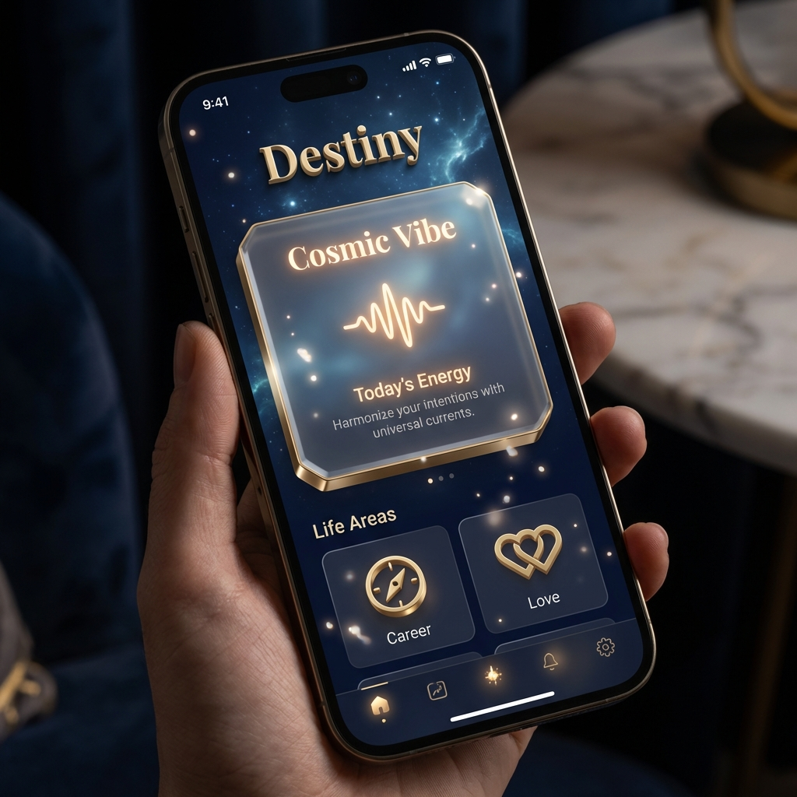

# Proposal: "Divine Luxury" Sensory Redesign
**Destiny AI Astrology - iOS Experience Update**

## 1. The Core Philosophy (The "Soul")
We are moving away from a traditional "App" interface (buttons, lists, pixels) to a "Sensory Artifact" experience. The goal is to make the user feel they are holding a magical, physical object—a "Golden Tablet" from the cosmos.

### The 5-Sense Stack
1.  **See (Visual):** Deep Space Navy + Living 3D Gold. No flat vectors.
2.  **Touch (Haptics):** The phone "throbs" like a heartbeat during AI thoughts. Success feels like a "purr".
3.  **Hear (Audio):** 432Hz Healing Frequencies. No generic beeps. "Cloud-touch" sound envelopes.
4.  **Feel (Proprioception):** Elements have "Weight" and lag behind device tilt (Inertia).
5.  **Sync (Bio-Rhythm):** Visuals and haptics pulse at 60 BPM to calm the user.

---

## 2. Visual Evolution: Before vs. After

| **Current State (Functional)** | **Proposed Future (Sensory)** |
| :--- | :--- |
|  |  |
| Flat cards, vector icons. | **Thick 3D Glass Slabs** with gold chamfered edges. |
| Static gradient background. | **Parallax Starfield** that moves with device tilt. |
| Standard text hierarchy. | **"Soul" Typography** (Playfair Display) + Glowing Ambers. |
| Buttons feel digital. | **Physical Interactions** (Weight, Light, Haptics). |

---

## 3. Key Design Pillars

### A. "The Golden Tablet" (Materiality)
UI elements will no longer be "on" the screen; they will be "floating inside" it.
*   **Technique:** Use `Tilt3DModifier` to rotate icons and cards in 3D space based on the user's wrist movement.
*   **Interaction:** Light sources reflect off gold edges dynamically as the phone rotates.

### B. "Bio-Sync" (Connection)
The app is alive.
*   **Heartbeat:** A subtle, rhythmic pulse (visual glow + haptic thud) at 60 BPM.
*   **Result:** This induces a "Flow State" in the user, synchronizing their breathing with the app.

### C. "Tibetan Soundscape" (Audio)
*   **Concept:** Every interaction is a "prayer bowl" strike, not a "click".
*   **Frequency:** 432Hz (Healing) and 528Hz (Miracle) base tones.
*   **Environment:** A silent 10Hz Alpha Wave drone plays at 3% volume to aid subconscious connection.

---

## 4. Technical Architecture Plan

We will introduce a centralized **`SensoryTheme`** engine to manage these layers without cluttering View code.

### `SensoryTheme.swift` (Manager)
*   **`MotionEngine`:** Monitors CoreMotion (Pitch/Roll) to drive 3D Tilt and Parallax.
*   **`HapticEngine`:** Manages CoreHaptics for "Heartbeats" and "Purrs".
*   **`SoundEngine`:** Synthesizes 432Hz tones using AVAudioEngine.

### New Custom Modifiers
*   `.tilt3D(depth: 10)`: Makes any view float in 3D space.
*   `.premiumInertia()`: Adds "weight" to scrolling and movement.
*   `.divineGlass()`: Applies the thick, gold-rimmed glass aesthetic.

---

## 5. Implementation Roadmap
1.  **Phase 1 (Foundation):** Create `SensoryTheme.swift` and basic Engines.
2.  **Phase 2 (Visuals):** Replace Home Screen cards with "Divine Glass" components; add Parallax background.
3.  **Phase 3 (Life):** Integrate Haptic Heartbeat and 432Hz Audio interactions.

This update effectively turns the "App" into a "Living Companion".
