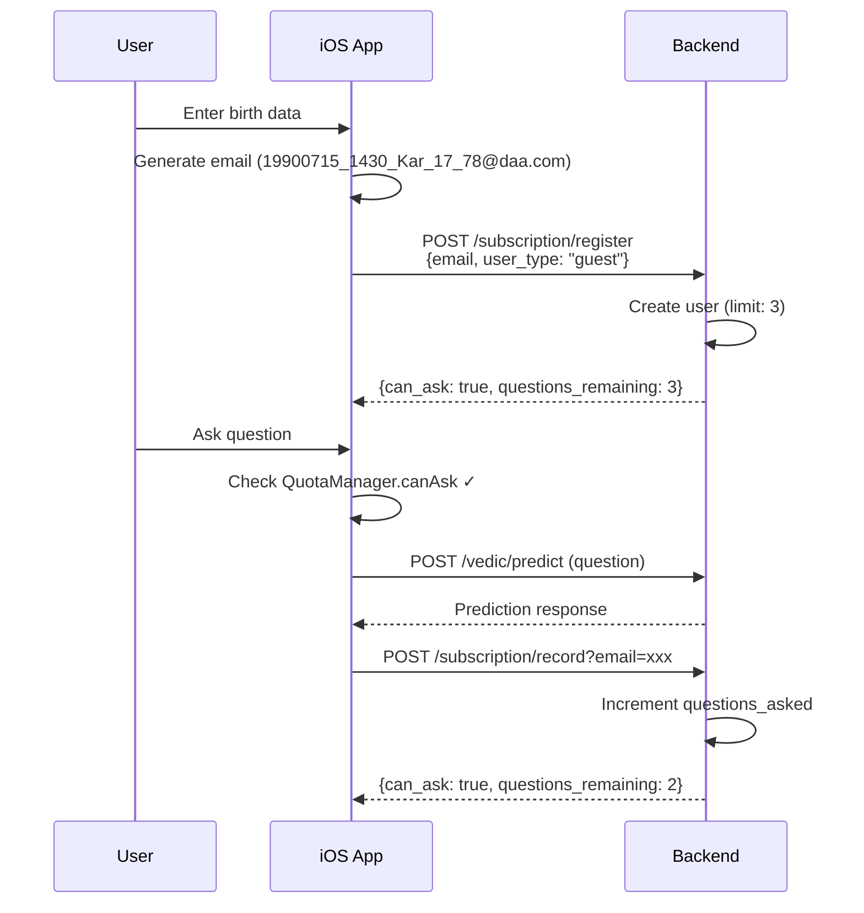
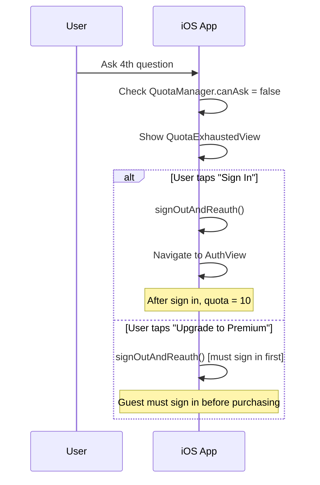
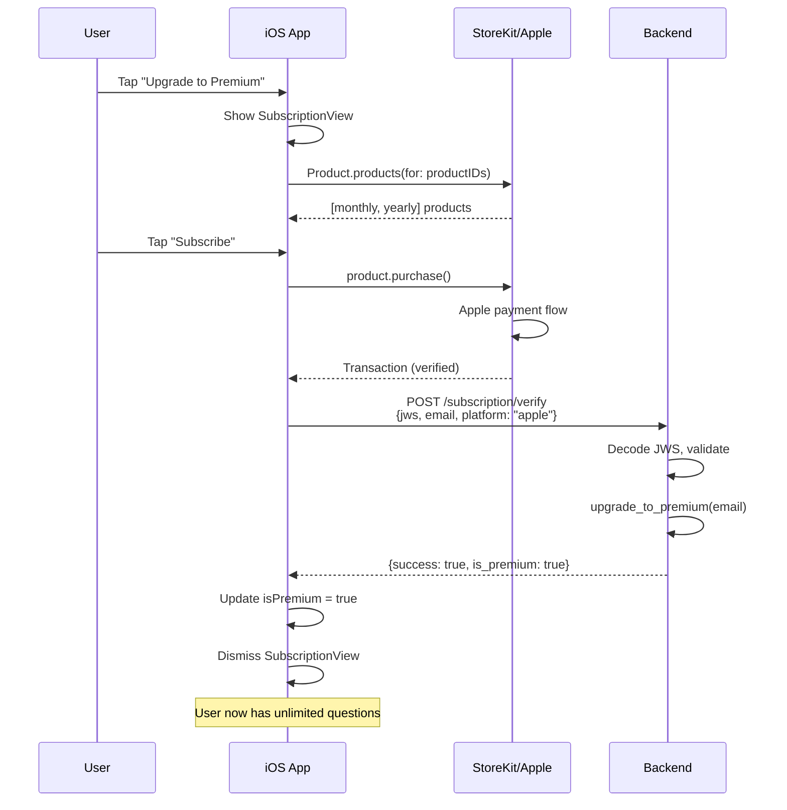
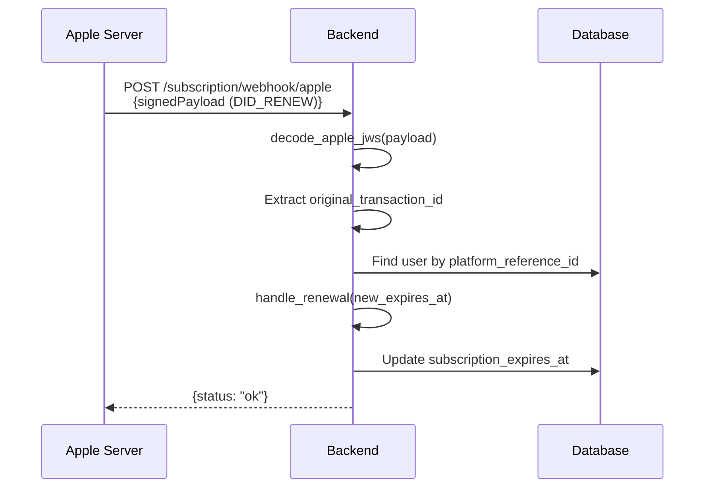
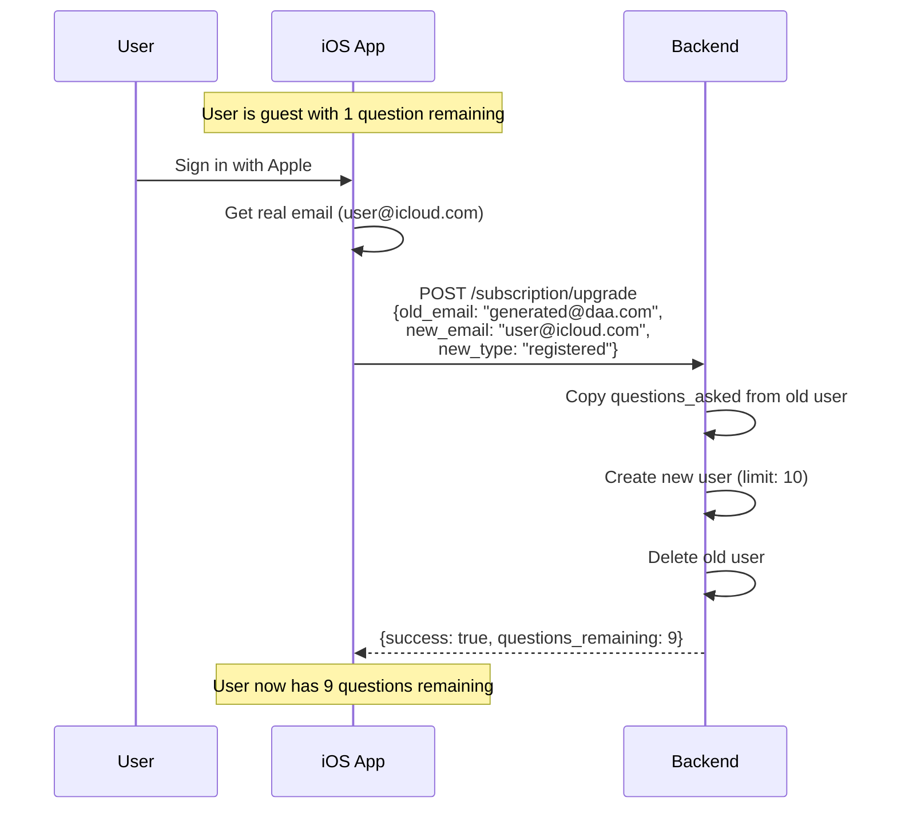

# Subscription System - End-to-End Flow

## Table of Contents
1. [Overview](#overview)
2. [Architecture](#architecture)
3. [Backend API Reference](#backend-api-reference)
4. [iOS Implementation](#ios-implementation)
5. [Entry Points](#entry-points)
6. [Complete Flows](#complete-flows)
7. [Data Models](#data-models)

---

## Overview

The subscription system manages user quota and premium access across the DestinyAI Astrology app. It supports three user types with different quota limits:

| User Type | Questions Limit | How to Get |
|-----------|-----------------|------------|
| **Guest** | 3 | New users with generated email |
| **Registered** | 10 | Sign in with Apple/Google |
| **Premium** | Unlimited (999,999) | Purchase subscription |

---

## Architecture

```
┌─────────────────────────────────────────────────────────────────┐
│                         iOS App                                  │
├─────────────────────────────────────────────────────────────────┤
│  ┌─────────────────┐   ┌─────────────────┐   ┌───────────────┐ │
│  │ QuotaManager    │   │ Subscription    │   │ Entry Points  │ │
│  │ (quota tracking)│   │ Manager         │   │               │ │
│  │                 │   │ (StoreKit 2)    │   │ • ChatView    │ │
│  │ - canAsk        │   │                 │   │ • Compat.View │ │
│  │ - questionsUsed │   │ - loadProducts  │   │ • FollowUp    │ │
│  │ - userType      │   │ - purchase      │   │               │ │
│  └────────┬────────┘   │ - verify        │   └───────────────┘ │
│           │            └────────┬────────┘                      │
└───────────┼─────────────────────┼───────────────────────────────┘
            │                     │
            │  HTTP REST API      │  StoreKit + HTTP
            ▼                     ▼
┌─────────────────────────────────────────────────────────────────┐
│                      Backend API                                 │
├─────────────────────────────────────────────────────────────────┤
│  ┌─────────────────────────┐   ┌──────────────────────────────┐ │
│  │  subscription_router.py │   │ Platform Services            │ │
│  │  /subscription/*        │   │  • apple_service.py          │ │
│  │                         │   │  • google_service.py         │ │
│  │  - POST /register       │   │  • stripe_service.py         │ │
│  │  - GET  /status         │   │                              │ │
│  │  - POST /record         │   │ Webhook Handlers             │ │
│  │  - POST /upgrade        │   │  - POST /webhook/apple       │ │
│  │  - POST /verify         │   │  - POST /webhook/google      │ │
│  │  - GET  /profile        │   │  - POST /webhook/stripe      │ │
│  │  - POST /profile        │   │                              │ │
│  └────────────┬────────────┘   └──────────────────────────────┘ │
│               │                                                  │
│               ▼                                                  │
│  ┌─────────────────────────┐                                    │
│  │    quota_service.py     │                                    │
│  │    (QuotaService)       │                                    │
│  │                         │                                    │
│  │  - get_or_create_user   │                                    │
│  │  - get_status           │                                    │
│  │  - record_question      │                                    │
│  │  - upgrade_to_premium   │                                    │
│  │  - handle_renewal       │                                    │
│  │  - handle_expiration    │                                    │
│  └────────────┬────────────┘                                    │
│               │                                                  │
│               ▼                                                  │
│  ┌─────────────────────────┐                                    │
│  │      SQLite Database    │                                    │
│  │   user_subscriptions    │                                    │
│  └─────────────────────────┘                                    │
└─────────────────────────────────────────────────────────────────┘
```

---

## Backend API Reference

### Base URL
```
Production: https://api.destinyai.app
Development: http://127.0.0.1:8000
```

### Endpoints

#### 1. Register User
```http
POST /subscription/register
```

**Request:**
```json
{
  "email": "user@example.com",
  "user_type": "guest",           // guest | registered | premium
  "is_generated_email": false
}
```

**Response:**
```json
{
  "user_email": "user@example.com",
  "user_type": "guest",
  "questions_asked": 0,
  "questions_limit": 3,
  "questions_remaining": 3,
  "can_ask": true,
  "is_premium": false,
  "subscription_status": null,
  "subscription_expires_at": null
}
```

#### 2. Get Status
```http
GET /subscription/status?email={email}
```

**Response:** Same as register response

#### 3. Record Question
```http
POST /subscription/record?email={email}
```

**Response:**
```json
{
  "success": true,
  "questions_asked": 2,
  "questions_remaining": 1,
  "can_ask": true
}
```

#### 4. Upgrade User (Guest → Registered)
```http
POST /subscription/upgrade
```

**Request:**
```json
{
  "old_email": "generated@daa.com",
  "new_email": "real@gmail.com",
  "new_type": "registered"
}
```

#### 5. Verify Purchase
```http
POST /subscription/verify
```

**Request:**
```json
{
  "signed_transaction": "eyJxxx...",  // JWS from Apple/Google/Stripe
  "user_email": "user@example.com",
  "platform": "apple",                 // apple | google | stripe
  "environment": "Production"          // Sandbox | Production
}
```

**Response:**
```json
{
  "success": true,
  "is_premium": true,
  "user_type": "premium",
  "questions_limit": 999999,
  "expires_at": "2025-01-03T12:00:00Z"
}
```

#### 6. Get Profile
```http
GET /subscription/profile?email={email}
```

**Response:** Status + birth_profile data

#### 7. Save Profile
```http
POST /subscription/profile
```

**Request:**
```json
{
  "email": "user@example.com",
  "user_name": "John Doe",
  "user_type": "guest",
  "is_generated_email": false,
  "birth_profile": {
    "date_of_birth": "1990-07-15",
    "time_of_birth": "14:30",
    "city_of_birth": "Mumbai",
    "latitude": 19.076,
    "longitude": 72.877,
    "gender": "male",
    "birth_time_unknown": false
  }
}
```

### Webhooks

| Platform | Endpoint | Status |
|----------|----------|--------|
| Apple | `POST /subscription/webhook/apple` | ✅ Implemented |
| Google | `POST /subscription/webhook/google` | 🟡 Partial |
| Stripe | `POST /subscription/webhook/stripe` | 🟡 Partial |

---

## iOS Implementation

### Key Services

#### 1. QuotaManager ([QuotaManager.swift](file:///Users/i074917/Documents/destiny_ai_astrology/ios_app/ios_app/Services/QuotaManager.swift))

**Purpose:** Track user quota locally and sync with server

**Key Properties:**
```swift
@Published private(set) var currentStatus: QuotaStatus
var canAsk: Bool { get }
var userTypeForAPI: String { get }
```

**Key Methods:**
```swift
func registerWithServer(email: String, userType: UserType, isGeneratedEmail: Bool) async throws
func syncStatusFromServer(email: String) async throws -> Bool
func recordQuestionOnServer(email: String) async throws
func recordQuestion()  // Local update
func refresh()         // Refresh from storage
```

#### 2. SubscriptionManager ([SubscriptionManager.swift](file:///Users/i074917/Documents/destiny_ai_astrology/ios_app/ios_app/Services/SubscriptionManager.swift))

**Purpose:** Handle StoreKit 2 purchases and verification

**Key Properties:**
```swift
@Published private(set) var products: [Product]
@Published private(set) var purchasedProductIDs: Set<String>
@Published private(set) var isPremium: Bool
@Published private(set) var isLoading: Bool
```

**Product IDs:**
```swift
static let monthlyProductID = "com.daa.premium.monthly"
static let yearlyProductID = "com.daa.premium.yearly"
```

**Key Methods:**
```swift
func loadProducts() async
func purchase(_ product: Product) async throws -> Bool
func restorePurchases() async
func updatePurchasedProducts() async
private func verifyWithBackend(transaction: Transaction) async
```

### Key Models

#### UserType Enum
```swift
enum UserType: String, Codable, Sendable {
    case guest = "guest"          // 3 questions
    case registered = "registered" // 10 questions
    case premium = "premium"       // Unlimited
}
```

#### QuotaStatus Struct
```swift
struct QuotaStatus: Sendable {
    let userType: UserType
    let questionsUsed: Int
    let questionsLimit: Int
    let canAsk: Bool
    let remainingQuestions: Int
}
```

### Key Views

#### 1. SubscriptionView ([SubscriptionView.swift](file:///Users/i074917/Documents/destiny_ai_astrology/ios_app/ios_app/Views/Subscription/SubscriptionView.swift))
- Premium upgrade screen
- Shows features, pricing, subscribe/restore buttons
- Integrates with `SubscriptionManager` for purchases

#### 2. QuotaExhaustedView ([QuotaExhaustedView.swift](file:///Users/i074917/Documents/destiny_ai_astrology/ios_app/ios_app/Components/QuotaExhaustedView.swift))
- Paywall popup when quota is exhausted
- **Guest users:** Shows "Sign In" + "Upgrade to Premium" buttons
- **Registered users:** Shows "Upgrade to Premium" button only

---

## Entry Points

### All quota-gated entry points:

| Entry Point | File | Line | Check Method |
|-------------|------|------|--------------|
| **Chat** | [ChatView.swift](file:///Users/i074917/Documents/destiny_ai_astrology/ios_app/ios_app/Views/Chat/ChatView.swift) | 62-66 | `viewModel.canAskQuestion` |
| **Compatibility Analysis** | [CompatibilityView.swift](file:///Users/i074917/Documents/destiny_ai_astrology/ios_app/ios_app/Views/Compatibility/CompatibilityView.swift) | 517-522 | `QuotaManager.shared.canAsk` |
| **Follow-up Questions** | [CompatibilityResultView.swift](file:///Users/i074917/Documents/destiny_ai_astrology/ios_app/ios_app/Views/Compatibility/CompatibilityResultView.swift) | 1060-1064 | `QuotaManager.shared.canAsk` |

### Entry Point Pattern:
```swift
// Before LLM call
if QuotaManager.shared.canAsk {
    // Proceed with API call
} else {
    showQuotaExhausted = true  // Show paywall
}

// Sheet modifier
.sheet(isPresented: $showQuotaExhausted) {
    QuotaExhaustedView(
        isGuest: isGuest,
        onSignIn: { signOutAndReauth() },
        onUpgrade: {
            if isGuest {
                signOutAndReauth()
            } else {
                showSubscription = true
            }
        }
    )
}
```

---

## Complete Flows

### Flow 1: Guest User First Question



### Flow 2: Quota Exhausted (Guest)



### Flow 3: Premium Purchase



### Flow 4: Subscription Renewal (Webhook)



### Flow 5: Guest → Registered Upgrade



---

## Data Models

### Backend: UserSubscription ([models.py](file:///Users/i074917/Documents/destiny_ai_astrology/astrology_api/astroapi-v2/app/core/shared_services/subscription/models.py))

```python
class UserSubscription(Base):
    # Primary key
    user_email: str              # Primary key (generated or real)
    
    # User classification
    user_type: str               # guest | registered | premium
    user_name: str               # Display name
    is_generated_email: bool     # True for guests
    
    # Quota tracking
    questions_asked: int         # Current count
    questions_limit: int         # Based on user_type
    
    # Subscription details
    subscription_platform: str   # apple | google | stripe | manual
    subscription_id: str         # Platform subscription ID
    product_id: str              # e.g., com.daa.premium.monthly
    subscription_status: str     # active | expired | grace_period | canceled
    subscription_start_at: datetime
    subscription_expires_at: datetime
    
    # Platform reference (for webhooks)
    platform_reference_id: str   # Apple: original_transaction_id
    environment: str             # Sandbox | Production
    
    # Birth profile data
    date_of_birth: date
    time_of_birth: str
    city_of_birth: str
    latitude: float
    longitude: float
    gender: str
    birth_time_unknown: bool
    
    # Timestamps
    created_at: datetime
    updated_at: datetime
    last_question_at: datetime
```

### Quota Limits

```python
QUOTA_LIMITS = {
    "guest": 3,
    "registered": 10,
    "premium": 999999,  # Unlimited
}
```

---

## Configuration Checklist

### App Store Connect
- [ ] Create subscription products (monthly, yearly)
- [ ] Configure App Store Server Notifications V2
  - Production URL: `https://api.destinyai.app/subscription/webhook/apple`
  - Sandbox URL: `https://api-staging.destinyai.app/subscription/webhook/apple`

### iOS App
- [ ] Add product IDs to `SubscriptionManager.productIDs`
- [ ] Configure StoreKit Configuration file for testing
- [ ] Set up `APIConfig.subscriptionVerify` endpoint

### Backend
- [ ] Set `APPLE_BUNDLE_ID` in environment
- [ ] Configure `APPLE_SHARED_SECRET` for receipt validation
- [ ] Run migrations: `create_tables()`

---

## Related Files

### Backend
- [subscription_router.py](file:///Users/i074917/Documents/destiny_ai_astrology/astrology_api/astroapi-v2/app/core/api/subscription_router.py) - REST API endpoints
- [quota_service.py](file:///Users/i074917/Documents/destiny_ai_astrology/astrology_api/astroapi-v2/app/core/shared_services/subscription/quota_service.py) - Business logic
- [models.py](file:///Users/i074917/Documents/destiny_ai_astrology/astrology_api/astroapi-v2/app/core/shared_services/subscription/models.py) - Database models
- [apple_service.py](file:///Users/i074917/Documents/destiny_ai_astrology/astrology_api/astroapi-v2/app/core/shared_services/subscription/apple_service.py) - Apple StoreKit verification
- [webhook.py](file:///Users/i074917/Documents/destiny_ai_astrology/astrology_api/astroapi-v2/app/core/shared_services/subscription/webhook.py) - Platform webhooks

### iOS
- [QuotaManager.swift](file:///Users/i074917/Documents/destiny_ai_astrology/ios_app/ios_app/Services/QuotaManager.swift) - Local quota tracking
- [SubscriptionManager.swift](file:///Users/i074917/Documents/destiny_ai_astrology/ios_app/ios_app/Services/SubscriptionManager.swift) - StoreKit 2 integration
- [SubscriptionView.swift](file:///Users/i074917/Documents/destiny_ai_astrology/ios_app/ios_app/Views/Subscription/SubscriptionView.swift) - Premium purchase UI
- [QuotaExhaustedView.swift](file:///Users/i074917/Documents/destiny_ai_astrology/ios_app/ios_app/Components/QuotaExhaustedView.swift) - Paywall popup
