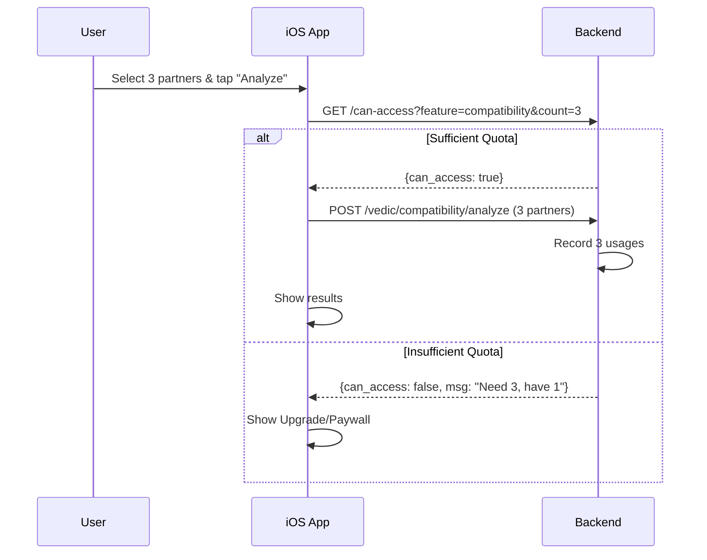
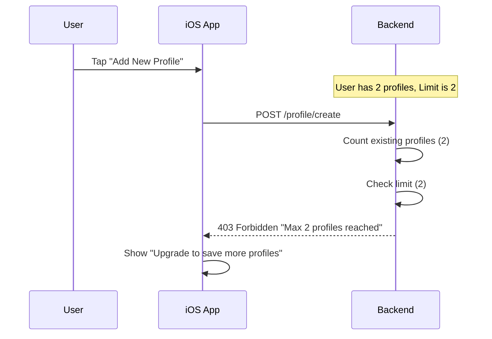

# Subscription System - End-to-End Flow

## Table of Contents
1. [Overview](#overview)
2. [Plans & Features](#plans--features)
3. [Architecture](#architecture)
4. [Backend API Reference](#backend-api-reference)
5. [iOS Implementation](#ios-implementation)
6. [Complete Flows](#complete-flows)

---

## Overview

The subscription system manages user access to specific features through a granular entitlement system. Unlike the previous single-bucket "questions" model, access is now controlled per-feature (e.g., `ai_questions`, `compatibility`, `maintain_profile`) with specific limits defined for each plan.

---

## Plans & Features

### Plans
| Plan ID | Description | Pricing |
|---------|-------------|---------|
| `free_guest` | Trial for new users (device-id based) | Free |
| `free_registered` | Sign-up bonus (email based) | Free |
| `core` | Personal clarity & insights | $4.99/mo |
| `plus` | Relationships & advanced features | $7.99/mo |

### Key Features
| Feature ID | Type | Enforcement |
|------------|------|-------------|
| `ai_questions` | Quota | Daily & Overall usage limits |
| `compatibility` | Quota | Daily & Overall usage limits (supports count check) |
| `maintain_profile` | Count | Maximum number of profiles allowed |
| `switch_profile` | Quota | Limit on first-time profile switches |
| `history` | Boolean | Always allowed |

---

## Architecture

```
┌─────────────────────────────────────────────────────────────────┐
│                         iOS App                                  │
├─────────────────────────────────────────────────────────────────┤
│  ┌─────────────────┐   ┌─────────────────┐   ┌───────────────┐ │
│  │ QuotaManager    │   │ Subscription    │   │ Entry Points  │ │
│  │ (Feature quotas)│   │ Manager         │   │               │ │
│  │                 │   │ (StoreKit 2)    │   │ • ChatView    │ │
│  │ - canAccess     │   │ - loadProducts  │   │ • CompatView  │ │
│  │ - featureUsage  │   │ - purchase      │   │ • ProfileView │ │
│  │ - planDetails   │   │ - verify        │   │               │ │
│  └────────┬────────┘   │                 │   └───────────────┘ │
│           │            └────────┬────────┘                      │
│           │                     │                               │
│           │  HTTP REST API      │  StoreKit + HTTP              │
│           ▼                     ▼                               │
┌─────────────────────────────────────────────────────────────────┐
│                      Backend API                                 │
├─────────────────────────────────────────────────────────────────┤
│  ┌─────────────────────────┐   ┌──────────────────────────────┐ │
│  │  subscription_router.py │   │ Platform Services            │ │
│  │  /subscription/*        │   │  • apple_service.py          │ │
│  │  - GET /status          │   │  • google_service.py         │ │
│  │  - GET /can-access      │   │                              │ │
│  │  - POST /register       │   │ Webhook Handlers             │ │
│  │  - POST /verify         │   │  - POST /webhook/apple       │ │
│  └────────────┬────────────┘   └──────────────────────────────┘ │
│               │                                                  │
│               ▼                                                  │
│  ┌─────────────────────────┐                                    │
│  │    quota_service.py     │                                    │
│  │  - check_feature_access │                                    │
│  │  - record_usage         │                                    │
│  └────────────┬────────────┘                                    │
│               ▼                                                  │
│      [PostgreSQL Database]                                      │
└─────────────────────────────────────────────────────────────────┘
```

---

## Backend API Reference

### 1. Get Subscription Status
Returns current plan and usage for all features.

```http
GET /subscription/status?email={email}
```

**Response:**
```json
{
  "user_email": "user@example.com",
  "plan_id": "core",
  "features": [
    {
      "feature_id": "ai_questions",
      "display_name": "Ask Anything",
      "daily_limit": 100,
      "overall_limit": 300,
      "daily_used": 12,
      "overall_used": 45,
      "remaining": 88
    },
    {
      "feature_id": "compatibility",
      "display_name": "Destiny Matching",
      "daily_limit": 25,
      "overall_limit": 100,
      "daily_used": 2,
      "remaining": 23
    }
  ]
}
```

### 2. Check Feature Access
Check if a specific feature can be used (optionally N times).

```http
GET /subscription/can-access?email={email}&feature={feature_id}&count={count}
```

**Response:**
```json
{
  "can_access": true,
  "reason": null,
  "remaining": 88
}
```
*Or if denied:*
```json
{
  "can_access": false,
  "reason": "daily_limit_reached",
  "upgrade_cta": {
    "title": "Daily Limit Reached",
    "message": "You've used all 3 free questions for today..."
  }
}
```

### 3. Verify Purchase
validate receipt and upgrade user.

```http
POST /subscription/verify
```

---

## iOS Implementation

### QuotaManager

Now generic and feature-based.

```swift
class QuotaManager: ObservableObject {
    func canAccessFeature(_ feature: FeatureID, count: Int = 1) async -> Bool {
        // 1. Check local cache first
        // 2. If close to limit or unsure, check API
        let response = await api.canAccess(feature, count: count)
        return response.canAccess
    }
}
```

### Usage Sites

| Feature | View | Check |
|---------|------|-------|
| `ai_questions` | ChatView | `canAccessFeature(.aiQuestions)` |
| `compatibility` | CompatibilityView | `canAccessFeature(.compatibility, count: partnerCount)` |
| `maintain_profile` | AddProfileView | `canAccessFeature(.maintainProfile)` |

---

## Complete Flows

### Flow 1: Compatibility Check (Upfront Quota)



### Flow 2: Maintain Profile (Count Limit)


